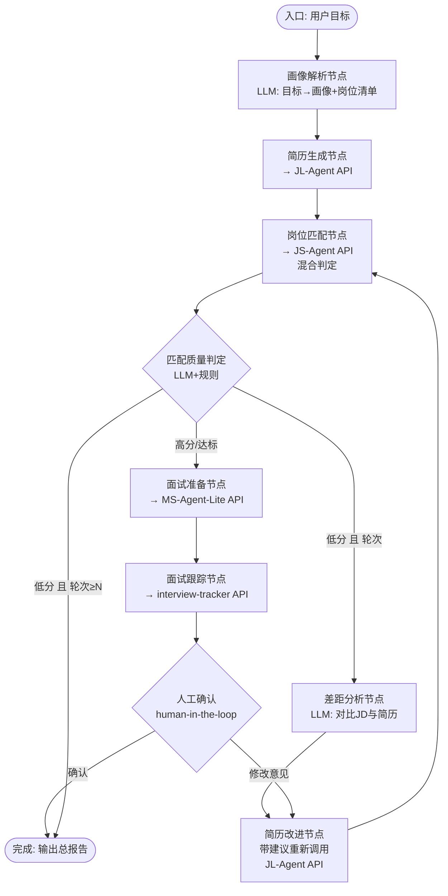

# 大脑构造：LangGraph 总调度器设计（job-hunter-orchestrator）

> 定位：自动求职系统的"大脑"——唯一真正的 Agent，负责决策、编排、反馈环
> 四个现有项目（改造后）= "手"：通过 HTTP API 被大脑调用

## 一、设计原则

1. **大脑只做决策，不做执行**：一切生成/搜索/匹配/跟踪的"体力活"由四个项目 API 完成，大脑用 LLM 判断"下一步做什么、结果好不好、要不要回退"
2. **反馈环是大脑的核心价值**：匹配分低 → 分析差距 → 改进简历 → 重新匹配（最多 N 轮）
3. **混合安全**：大脑的每个决策都有代码级刹车（轮数上限、预算、超时、人工确认点）
4. **可观测**：LangGraph Checkpointer 持久化 + LangSmith 追踪 + Studio 可视化

## 二、State 定义（共享求职档案）

```python
class JobHunterState(TypedDict):
    # 用户输入
    user_goal: str                    # 原始诉求："找自动驾驶方向实习"
    profile: dict                     # 求职者画像（背景/技能/经历）
    target_jobs: list[dict]           # 目标岗位清单（来自画像解析）

    # 简历环节
    resume: dict                      # 当前简历（各板块数据）
    resume_round: int                 # 简历迭代轮次
    resume_feedback: list[str]        # 来自匹配环节的改进建议

    # 匹配环节
    match_results: list[dict]         # 岗位匹配结果（score+reasons）
    match_round: int                  # 匹配轮次
    search_queries: list[str]         # 搜索词历史

    # 面试准备环节
    interview_materials: dict         # 生成的材料（各文件）

    # 跟踪环节
    tracking_records: list[dict]      # 投递/面试记录

    # 控制
    max_rounds: int                   # 反馈环上限（默认 3）
    user_approvals: dict              # 人工确认记录
    errors: list[str]                 # 错误收集
```

## 三、图结构（核心）



## 四、节点详细设计

### 1. 画像解析节点（parse_profile）
- LLM 调用（LangChain + DeepSeek）：用户一句话 → 结构化画像 + 目标岗位清单
- 规则校验：必填字段（背景/技能）缺失 → 追问用户（interrupt）

### 2. 简历生成节点（resume_agent）
- `httpx.post(JL_AGENT_URL + "/api/generate", json={profile, jd_list})` → 轮询 `/api/task/{id}`
- 收到 `resume_feedback` 时：把改进建议注入请求（改造后的 JL-Agent 支持"带建议生成"）
- 超时/失败 → 重试 1 次 → 仍失败则记录 errors，跳过该环节（降级）

### 3. 岗位匹配节点（match_agent）
- `httpx.post(JS_AGENT_URL + "/api/match", json={profile, resume})` → 轮询结果
- 返回 `match_results`（每条含 score + reasons——改造后混合判定输出）

### 4. 匹配质量判定（gate_match）——大脑的第一个决策点
- **规则层**（代码）：匹配数 > 0？最高分 ≥ 阈值（如 70）？
- **LLM 层**：对最高分岗位的 reasons 做语义评估（"这是真匹配还是幻觉匹配"）
- 输出：pass / fail + 差距摘要

### 5. 差距分析节点（gap_analysis）——反馈环的大脑
- LLM：对比"最高分岗位 JD" vs "当前简历" → 输出结构化差距清单
  ```json
  [{"gap": "缺少数据分析项目", "suggestion": "补充XX项目描述", "priority": "high"}]
  ```
- 规则过滤：建议不得要求"编造经历"（禁区词检查：捏造/虚构/夸大）

### 6. 简历改进节点（resume_feedback）
- 把差距清单作为"生成指令"传给 JL-Agent（带建议重生成）
- `resume_round += 1`；`resume_round >= max_rounds` → 强制进入下一环节

### 7. 面试准备节点（prep_agent）
- `httpx.post(MS_AGENT_URL + "/api/material", json={resume, jd, materials...})`
- 轮询任务状态（改造后支持审核回路进度上报）

### 8. 面试跟踪节点（track_agent）
- `httpx.post(TRACKER_URL + "/api/records", ...)` 写入投递记录
- 或 LLM 生成"投递建议"（面试时间安排、跟进话术）

### 9. 人工确认点（human-in-the-loop）
- 简历定稿前：`interrupt()` 等用户确认（Studio/API 均可恢复）
- 投递执行前：确认目标岗位列表

## 五、反馈环与刹车

```
match_round: 0 → 1 → 2 → 3（上限）
条件：score < 70 且 match_round < max_rounds → 回退
刹车：轮数上限（3）、单轮耗时上限（10min）、LLM 预算上限（每轮 token 计数）
```

## 六、工程结构（新建项目）

```
D:\TRAE\WORKSPACE\job-hunter-orchestrator\
├── graph\
│   ├── state.py          # State 定义（Pydantic）
│   ├── nodes\
│   │   ├── parse_profile.py
│   │   ├── resume_agent.py
│   │   ├── match_agent.py
│   │   ├── gate_match.py
│   │   ├── gap_analysis.py
│   │   ├── prep_agent.py
│   │   ├── track_agent.py
│   │   └── report.py
│   └── build.py          # StateGraph 装配 + 条件边
├── clients\
│   ├── jl_client.py      # JL-Agent API 客户端（提交/轮询/导出）
│   ├── js_client.py
│   ├── ms_client.py
│   └── tracker_client.py
├── llm\
│   ├── provider.py       # DeepSeek 封装（langchain-openai）
│   └── prompts.py        # 画像解析/差距分析/质量判定提示词
├── server\
│   ├── app.py            # FastAPI：/run /status /approve
│   └── config.py         # 四项目 URL、模型、预算配置
├── requirements.txt      # langgraph, langchain-openai, httpx, fastapi, pydantic
└── langgraph.json        # LangGraph 配置（Studio/CLI 用）
```

## 七、LangGraph 集成接口（大脑对外）

| 接口 | 说明 |
|---|---|
| `POST /run` | 提交任务：{user_goal, profile?} → {task_id} |
| `GET /status/{task_id}` | 轮询：当前节点、阶段进度、结果 |
| `POST /approve/{task_id}` | 人工确认（resume 定稿/投递）|
| `GET /report/{task_id}` | 最终总报告（Markdown/JSON）|
| `GET /graph` | 图结构（Studio/可视化用）|

Dify 对接：工作流里 2-4 个 HTTP 节点（发起 → 轮询 → 展示报告），或把大脑作为 Dify 的"工具"。

## 八、与三个项目改造的关系

| 改造项 | 归属 | 大脑如何用 |
|---|---|---|
| JL-Agent 审核回路 | 留在 JL-Agent 内 | 大脑只传建议，不干预内部回路 |
| JS-Agent 混合判定+搜索回路 | 留在 JS-Agent 内 | 大脑消费 score+reasons，驱动跨环节反馈环 |
| MS-Agent-Lite 审核回路 | 留在 MS-Agent-Lite 内 | 大脑只提交/轮询/取结果 |
| **跨环节反馈环**（匹配→简历） | **大脑专属** | 项目之间唯一的"智能连接"，只能在编排层实现 |

## 九、实施顺序

1. 先搭大脑骨架（State + 4 节点顺序执行 + 无反馈环）→ Studio 可视化跑通
2. 加 gate_match + gap_analysis 反馈环 → 模拟数据验证
3. 接入四项目真实 API（配合各自的改造完成）
4. 加 Checkpointer 持久化 + human-in-the-loop
5. 部署 + Dify 对接
