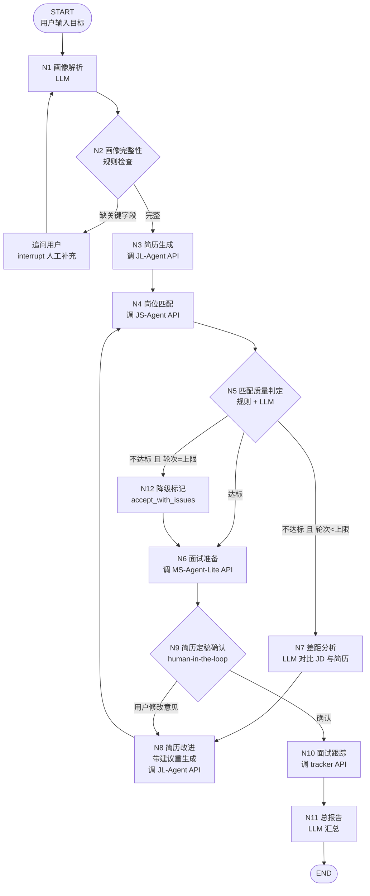

# 大脑 Workflow 详细设计（可审核版）

> 版本：v0.1（待审核）｜ 修改指南见文末 §9
> 配套：`0_大脑构造-LangGraph调度器设计.md`（架构总览）
> 阅读方式：§1 总图 → §2 节点规格 → §3 边语义 → §4 State → §5 常量 → §6 端到端示例 → §7 待决策清单 → §8 修改指南

---

## §1 总图（Mermaid，可直接改）

**图例**：`[方角]`=执行节点；`{菱形}`=判定/分支；`([圆角])`=起止；`interrupt`=暂停等人

---

## §2 节点规格（逐节点可审核）

### N1 画像解析（parse_profile）
| 项 | 内容 |
|---|---|
| 类型 | LLM（LangChain + DeepSeek-V4-Flash）|
| 输入 | `user_goal`（用户原始诉求）|
| 输出 | `profile`（结构化画像：背景/技能/经历/偏好）、`target_jobs`（目标岗位清单，≤5 条）|
| 提示词要点 | 从一句话提取：教育背景、技能栈、项目经历、求职偏好（城市/方向/薪资）；输出严格 JSON |
| 规则/刹车 | 输出 JSON 校验失败 → 重试 1 次 → 失败则返回追问问题 |
| 超时 | 60s |
| 失败处理 | 记录 errors，转 N2 时标记 `profile_incomplete` |

### N2 画像完整性检查（check_profile）
| 项 | 内容 |
|---|---|
| 类型 | 纯规则（代码）|
| 检查项 | 必填：技能栈 ≥1 项、经历 ≥1 条；建议：城市/方向偏好 |
| 输出 | `missing_fields`（缺失清单）|
| 分支 | 有缺失 → interrupt 追问用户补充 → 回到 N1（带补充信息）；无缺失 → N3 |
| 刹车 | 追问轮数 ≤2，超过则带缺失标记继续 |

### N3 简历生成（resume_generate）
| 项 | 内容 |
|---|---|
| 类型 | API 调用（HTTP → JL-Agent `POST /api/generate` + 轮询 `GET /api/task/{id}`）|
| 输入 | `profile`、`target_jobs[0]`（首选岗位 JD）、可选 `resume_feedback`（来自 N8 的改进建议）|
| 输出 | `resume`（各板块数据）、`resume_round`（+1）|
| 说明 | JL-Agent 内部已有 reviewing 审核回路（见 JL-Agent_改造设计.md），大脑不干预内部 |
| 超时 | 提交 30s + 轮询总时限 10min |
| 失败处理 | 重试 1 次 → 仍失败：errors 记录，跳过匹配直接进 N6（降级）|

### N4 岗位匹配（match_jobs）
| 项 | 内容 |
|---|---|
| 类型 | API 调用（HTTP → JS-Agent `POST /api/match` + 轮询）|
| 输入 | `resume`、`target_jobs`、`profile` |
| 输出 | `match_results[]`（每条：job_id/title/company/score/reasons/resume_tips）|
| 说明 | JS-Agent 内部已有混合判定 + 搜索回路（见 JS-Agent_改造设计.md）|
| 超时 | 提交 30s + 轮询总时限 15min |
| 失败处理 | 重试 1 次 → 失败：errors 记录，跳过判定直接进 N6（降级）|

### N5 匹配质量判定（gate_match）★ 大脑第一个决策点
| 项 | 内容 |
|---|---|
| 类型 | 混合（规则层 + LLM 层）|
| 规则层 | ① `match_results` 非空？② 最高分 ≥ `match_pass_threshold`（默认 70）？③ 达标岗位数 ≥1？ |
| LLM 层 | 对最高分岗位的 `reasons` 做语义可信度评估：真匹配 or 幻觉匹配？（宽松 PASS 策略）|
| 输出 | `gate_verdict`（pass / fail / degraded）、`gap_summary`（不达标时：差距摘要）|
| 分支 | pass → N6；fail 且 `match_round < max_match_rounds` → N7；fail 且轮次已满 → N12 |
| 刹车 | LLM 层失败 → 只看规则层（不阻塞流程）|

### N7 差距分析（gap_analysis）★ 反馈环的大脑
| 项 | 内容 |
|---|---|
| 类型 | LLM |
| 输入 | 最高分岗位 JD、`resume`、`reasons` |
| 输出 | `resume_feedback[]`（结构化：gap / suggestion / priority high-mid-low）|
| 提示词要点 | 只允许"补充描述/调整表达/突出相关技能"，**禁止**要求编造经历 |
| 规则过滤 | 禁区词检查（捏造/虚构/伪造/夸大…）命中 → 删除该条建议 |
| 刹车 | 建议条数 ≤5；每次反馈环只产出新建议（去重）|

### N8 简历改进（resume_improve）
| 项 | 内容 |
|---|---|
| 类型 | API 调用（HTTP → JL-Agent 带 `resume_feedback` 重生成）|
| 输入 | `resume_feedback`、原 `resume` |
| 输出 | 新 `resume`、`match_round`（+1）|
| 说明 | JL-Agent 的 edited 锁定机制保证用户手动改过的内容不被覆盖 |
| 分支 | 回到 N4（重新匹配）|

### N6 面试准备（prep_materials）
| 项 | 内容 |
|---|---|
| 类型 | API 调用（HTTP → MS-Agent-Lite `POST /api/material` + SSE/轮询）|
| 输入 | `resume`、最优岗位 JD、`profile` |
| 输出 | `interview_materials`（结构化文件索引 + qualitySummary）|
| 说明 | MS-Agent-Lite 内部已有文件级审核回路（白名单 4 文件）|
| 超时 | 总时限 15min |
| 失败处理 | 重试 1 次 → 失败：降级标记，跳过 N9 直接 N10 |

### N9 简历定稿确认（confirm_resume）★ 人工确认点
| 项 | 内容 |
|---|---|
| 类型 | human-in-the-loop（`interrupt()`）|
| 展示 | 最终简历 + 匹配清单 + 面试材料索引（供用户预览）|
| 用户动作 | 确认 → N10；提出修改 → N8（带用户意见）；拒绝 → END（记录原因）|
| 刹车 | 无轮次限制（人工决定），但提供"跳过确认"开关（`skip_confirm=true` 配置）|

### N10 面试跟踪（track_jobs）
| 项 | 内容 |
|---|---|
| 类型 | API 调用（HTTP → interview-tracker）|
| 输入 | 确认的岗位清单、投递计划（LLM 生成时间安排建议）|
| 输出 | `tracking_records`（投递记录/面试安排）|
| 说明 | tracker 是工具型应用，只写记录不决策 |

### N11 总报告（final_report）
| 项 | 内容 |
|---|---|
| 类型 | LLM 汇总 + 模板组装 |
| 输入 | 全部 State |
| 输出 | Markdown 总报告：简历摘要 / 匹配清单（分数+理由）/ 面试准备索引 / 跟踪计划 / 遗留问题（errors、accept_with_issues 标记）|
| 格式 | 同时输出 JSON（供 Dify 展示）|

### N12 降级标记（degrade_mark）
| 项 | 内容 |
|---|---|
| 类型 | 规则 |
| 动作 | 标记 `match_verdict = accept_with_issues`（记录原因），继续流程 |
| 目的 | 反馈环到上限也不阻塞整单——求职系统"有结果"优先 |

---

## §3 边语义表

| 边 | 从 → 到 | 条件 | 动作/数据 | 刹车 |
|---|---|---|---|---|
| E1 | N1 → N2 | 恒真 | 传递 profile | - |
| E2 | N2 → N1B | 缺必填字段 | interrupt 追问 | 追问 ≤2 轮 |
| E3 | N1B → N1 | 用户补充完成 | 携带补充信息 | - |
| E4 | N2 → N3 | 完整性通过 | profile → 简历生成 | - |
| E5 | N3 → N4 | 简历生成成功 | resume → 匹配 | 失败降级跳 N6 |
| E6 | N4 → N5 | 匹配完成 | match_results → 判定 | 失败降级跳 N6 |
| E7 | N5 → N6 | verdict=pass | - | - |
| E8 | N5 → N7 | fail 且 round<max | gap_summary → 差距分析 | round 上限=3 |
| E9 | N7 → N8 | 差距清单非空 | resume_feedback → 改进 | 建议 ≤5 条 |
| E10 | N8 → N4 | 重生成完成 | 新 resume → 重新匹配 | round+1 |
| E11 | N5 → N12 | fail 且 round≥max | 降级标记 | - |
| E12 | N12 → N6 | 恒真 | 带标记进准备环节 | - |
| E13 | N6 → N9 | 材料生成完成 | - | - |
| E14 | N9 → N8 | 用户提修改 | 用户意见 → 改进 | 人工控制 |
| E15 | N9 → N10 | 用户确认 | - | - |
| E16 | N10 → N11 | 跟踪完成 | records → 报告 | - |

---

## §4 State 字段定义（JobHunterState）

| 字段 | 类型 | 默认 | 写入者 |
|---|---|---|---|
| user_goal | str | "" | START |
| profile | dict | {} | N1 |
| target_jobs | list | [] | N1 |
| resume | dict | {} | N3/N8 |
| resume_round | int | 0 | N3/N8 |
| resume_feedback | list | [] | N7/N9 |
| match_results | list | [] | N4 |
| match_round | int | 0 | N8 |
| gate_verdict | str | "" | N5/N12 |
| gap_summary | str | "" | N5 |
| interview_materials | dict | {} | N6 |
| tracking_records | list | [] | N10 |
| report | dict | {} | N11 |
| errors | list | [] | 各节点 |
| user_approvals | dict | {} | N2/N9 |
| config | dict | 默认 | START（含 skip_confirm 等）|

---

## §5 常量与阈值表（改这里即可调参）

| 常量 | 默认值 | 说明 |
|---|---|---|
| `match_pass_threshold` | 70 | 匹配达标分数 |
| `max_match_rounds` | 3 | 反馈环轮数上限 |
| `max_profile_retries` | 2 | 画像追问轮数 |
| `max_feedback_items` | 5 | 差距建议条数上限 |
| `api_submit_timeout` | 30s | API 提交超时 |
| `api_poll_timeout` | 10-15min | 各项目轮询总时限 |
| `llm_timeout` | 60s | 大脑 LLM 调用超时 |
| `skip_confirm` | false | 是否跳过人工确认 |
| `llm_provider` | deepseek-v4-flash | 大脑 LLM 模型 |

---

## §6 端到端示例（walkthrough）

用户输入：*"我硕士在读，做过自动驾驶感知项目，想找实习，方向是决策规划"*

1. **N1** 解析 → profile{技能:[Python/C++/深度学习], 经历:[感知项目], 偏好:[实习/决策规划]}；target_jobs=[决策规划实习生×3]
2. **N2** 完整 → 通过
3. **N3** 调 JL-Agent → 生成决策规划方向简历
4. **N4** 调 JS-Agent → 搜出 5 个岗位，最高分 62（<70）
5. **N5** 判定 fail，round=1<3 → 差距分析
6. **N7** 差距：① 缺"轨迹预测"关键词 ② 项目量化不足 ③ 缺 PID 控制经验表述
7. **N8** 带建议重生成 → **N4** 再匹配 → 最高分 78 ✅
8. **N5** pass → **N6** 调 MS-Agent-Lite → 生成面试材料（审核回路通过）
9. **N9** interrupt → 用户确认 → **N10** 写入跟踪记录 → **N11** 总报告
10. **END** 输出：简历 + 3 个达标岗位（分数/理由）+ 面试材料清单 + 投递计划

---

## §7 待决策清单（请审核时拍板）

| # | 问题 | 我的建议 | 你的决定 |
|---|---|---|---|
| D1 | 匹配达标阈值 70 合适吗？ | 70（JS-Agent 现有 80/60 参考）| |
| D2 | 反馈环上限 3 轮？ | 3（成本可控）| |
| D3 | 人工确认点：只要"简历定稿"一个？还是加"投递前确认"？ | 先只保留定稿确认 | |
| D4 | 差距分析是否允许自动触发"深挖岗位"（对高分岗位扩散搜索）？ | 第一版不做，后续加 | |
| D5 | 总报告格式：Markdown + JSON 双输出？ | 是 | |
| D6 | 面试跟踪环节第一版只"写记录"还是加"LLM 投递建议"？ | 只写记录（最小可用）| |
| D7 | 失败降级策略：任一步失败是"跳过继续"还是"整单失败"？ | 跳过继续（求职系统有结果优先）| |
| D8 | 是否要"跳过确认"配置开关？ | 要（测试用）| |

---

## §8 修改指南（怎么改这份设计）

| 想改什么 | 改哪里 |
|---|---|
| 加/删/改节点 | §1 Mermaid 图 + §2 增删节点节 + §3 边表 |
| 调参数（阈值/轮数） | §5 常量表 |
| 改 State 字段 | §4 表 |
| 改分支条件 | §3 边语义表 + §2 对应节点"分支"行 |
| 改提示词要点 | §2 对应节点"提示词要点"行 |
| 记录你的决定 | §7 待决策清单"你的决定"列 |

## §9 下一步（审核通过后）

1. 按 §7 决策定稿 v0.2
2. 搭骨架代码：`D:\TRAE\WORKSPACE\job-hunter-orchestrator`（State + 节点 + 条件边 + 模拟模式）
3. 桌面启动器 → Studio Web 看可视化 → 逐节点验证
