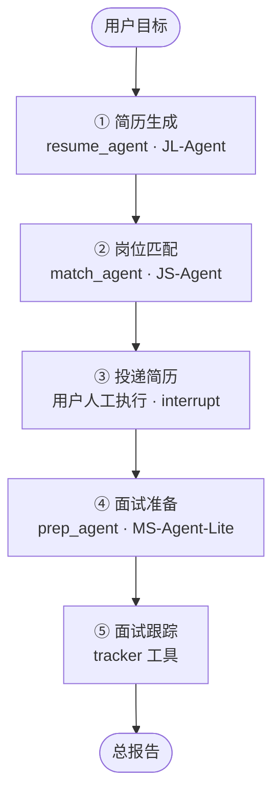
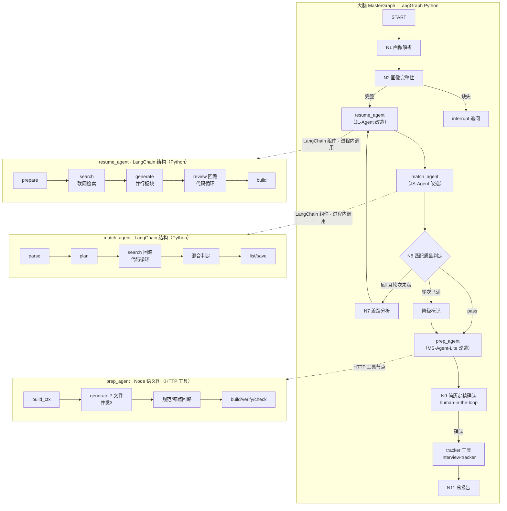
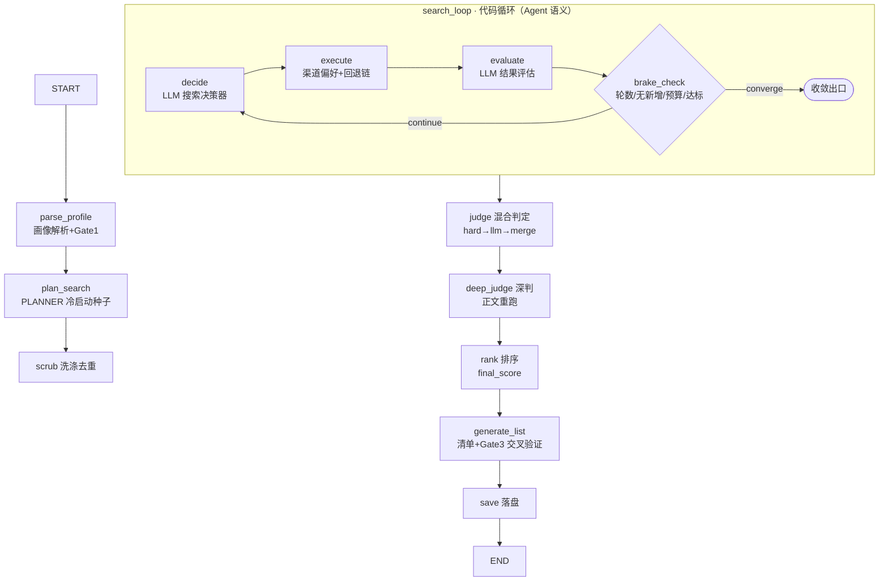
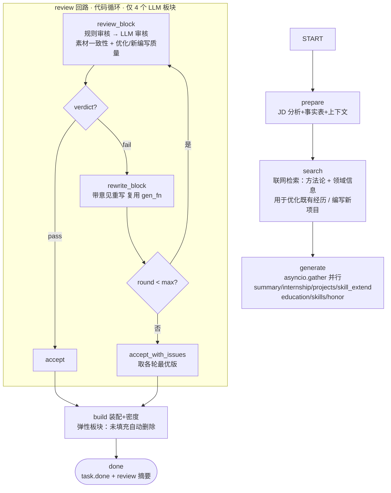
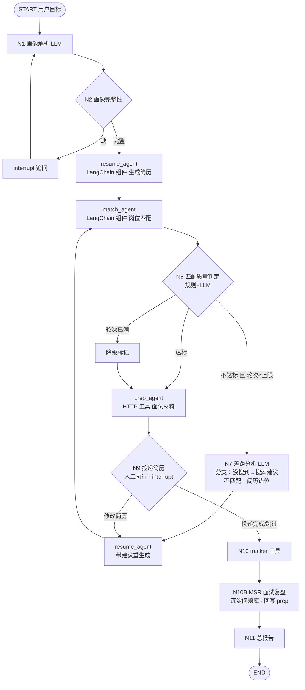

# 大改造架构设计 v2.0（定稿版）

> 状态：**v2.0 定稿**（2026-08-15）——子项目基本架构已通顺（用户确认），进入实施阶段
> 更新时间：2026-08-15（定稿：D1-D8 按推荐值确认；Q10 投递清单确认；三处边界纠偏——JS 只筛选不投递 / tracker 用户手动录入、大脑只读 / MS 核心料用户手动输入 + 自动获取保留）
> 历史：2026-08-14（v0.2：MS 产物结构规范 §4.5 + 审核回路定位修正 §4.3/§4.4 + 新增 MSR 工具 §0.5.2/§5/§6.1 + MSR↔prep 联动 §5.5 + D9/D10 已确认）
> 配套文档：`0_大脑构造-LangGraph调度器设计.md`（大脑总览）｜`1_大脑Workflow详细设计-v0.1.md`（大脑 11 节点）｜`3_总实施计划-v1.md`（v1 计划）｜`JL/JS/MS-Agent-Lite_改造设计.md`（三份子项目改造设计）｜`产物约束清单.md`｜`JS搜索回路详细设计.md`｜`投递清单生成设计.md`
> 阅读方式：§1 总框架 → §2-4 每子项目改造设计 → §5 大脑多 Agent 调度 → §6 State 契约 → §7 实现路径 → §8 决策清单

---

## §0 为什么需要 v2.0（从「选择性 Agent 化」升级为「全 Agent 化」）

### 0.1 v1 的立场

`3_总实施计划-v1.md` 的判定：**只有 JS-Agent 是真 Agent 化**（LLM 决策回路），JL-Agent / MS-Agent-Lite 只加"确定性质量回路"，interview-tracker 纯工具。理由：简历内容不允许 LLM 自主发挥（防编造）；Node 零依赖原则；LangGraph 对有限循环是"杀鸡用牛刀"。

### 0.2 本次升级（用户新诉求）

> 「这四个项目基本都是自动化脚本，不涉及 Agent 的构造。希望除 interview-tracker 外的三个项目**本身就是 langchain 或 langgraph 结构**，然后再并入 langgraph，最终达到一个 langgraph 的多 Agent 调度结构。」

即：**三个子项目自身也要成为 Agent（LangGraph/LangChain 结构），而非只被大脑调用的"手"**。这与 v1 的论证方向相反，是本次 v2.0 的核心变化。

### 0.3 v2.0 的 Agent 化判定标准（第一性原理）

**Agent = LLM 参与决策 + 反馈回路 + 终止条件/刹车**。对照三个项目：

| 子项目 | 决策点（LLM 参与） | 反馈回路 | 终止条件 | 结论 |
|---|---|---|---|---|
| JS-Agent | 搜索策略（下一步行动）、判定质量 | 搜索决策→执行→评估→收敛；判定→改进 | 轮数/无新增/预算上限 | **真 Agent**（决策型） |
| JL-Agent | 生成内容（各板块） | 生成→审核→重写→复审 | 审核通过/重写轮次上限 | **生成-批判型 Agent** |
| MS-Agent-Lite | 生成内容（7 文件） | 生成→规范/锚点审核→回炉→复审 | 审核通过/回炉轮次上限 | **生成-批判型 Agent** |
| MSR（新） | 问题分类、短板识别、复盘提炼 | 沉淀→复用闭环（与 prep_agent 联动） | 单次处理 | **生成-分类型 Agent** |
| interview-tracker | 无 | 无 | — | 纯工具（不改造） |

> 说明：v1 担心"LLM 自主发挥防编造"。v2.0 保留该护栏——审核回路是**带意见重写 + 轮次上限 + 编辑锁定**的受控回路，不是开放式的自由 Agent 循环（详见 §3.3 / §4.3）。"Agent 化"是**结构形态**的升级，不是"放开自主权"。

---

## §0.5 总体流程（主线五步 · 暂不含回路）

> 用户确认（2026-08-14）：JobHunter 总流程 = **简历生成 → 岗位匹配 → 投递简历 → 面试准备 → 面试跟踪**，其中**投递简历由用户手动执行**。本节先定主线，回路（匹配反馈环 / 审核回路）后续章节展开。

### 0.5.1 主线流程图



### 0.5.2 各步职责与归属

| 步骤 | 执行者 | 输入 | 产物 | 说明 |
|---|---|---|---|---|
| ① 简历生成 | **resume_agent**（JL-Agent 改造） | 用户画像/简历素材 + 目标方向 | 简历（可多版本 A/B） | 内含画像解析；内部审核回路（§3，后置） |
| ② 岗位匹配 | **match_agent**（JS-Agent 改造） | 简历 + 目标岗位清单 | 匹配结果（score/reasons/resume_tips + **岗位↔简历版本对应**）；**投递清单由大脑节点生成**（Q10a：match_agent 只出候选，用户终选） | 内部搜索回路 + 混合判定（§2，后置） |
| ③ 投递简历 | **用户**（Agent 只产出建议） | 投递清单 | 用户反馈的投递结果（已投公司/岗位/进度） | **human-in-the-loop**：大脑 interrupt 暂停，等用户投递完成或跳过 |
| ④ 面试准备 | **prep_agent**（MS-Agent-Lite 改造） | **用户手动输入**：岗位 JD + 简历（选 JL 生成版本或用户上传）+ 参考网页（可选）；**自动获取保留**：面经搜索/公司背景联网/OCR 项目全文 | 面试材料（自我介绍/项目深挖/技术题/反问/面经/数字口径/公司背景） | 内部规范/锚点审核回路（§4，后置）；只对已投岗位生成，避免浪费（纠偏 2026-08-15：核心料用户手动输入 + 辅助料自动获取） |
| ⑤ 面试跟踪 | **tracker 工具**（interview-tracker） | 用户**手动录入**的投递/面试记录 | 进度总表 + 跟进提醒 | 纯记录，无决策，不改造；**大脑不自动写入，只读汇总**（纠偏 2026-08-15） |
| ⑤b 面试复盘 | **MSR 工具**（新项目） | 面试任意来源文字（语音转文字/回忆） | 按技术栈分类、标注公司岗位的面试问题库 + 复盘报告（问题分析+补强建议） | 面试后事件触发；与 prep_agent 联动（面试前注入提问模式 profileHints、面试后回写缺口，详见 §5.5） |

### 0.5.3 关键语义（与 v0.1 大脑设计的差异）

1. **投递 = 人工环节**：大脑在 ② 与 ④ 之间 `interrupt()`，向用户展示投递清单（岗位、简历版本、投递理由、优先级），**不自动投递**；用户投递完成后反馈进度（或显式跳过），流程才进入面试准备。
2. **面试准备的输入是"已投递岗位"**：v0.1 是目标岗位直接进 prep；现改为投递后按真实进入面试流程的岗位生成材料，避免对未投递岗位浪费生成成本。
3. **主线不含回路**：匹配质量判定后的反馈环（v0.1 N5→N7→N8）与各子项目内部审核回路，在主线跑通后叠加（§7 里程碑 M5 反馈环调优）。

### 0.5.4 与 v0.1 大脑节点的映射

| 主线步骤 | v0.1 大脑节点 |
|---|---|
| ① 简历生成 | N1 画像解析 + N2 完整性 + N3 简历生成 |
| ② 岗位匹配 | N4 岗位匹配 + N5 匹配质量判定（闸门语义保留） |
| ③ 投递简历 | **新增人工步骤**（原 N9 定稿确认提前至此处，语义扩展为"投递执行确认"） |
| ④ 面试准备 | N6 面试准备 |
| ⑤ 面试跟踪 | N10 面试跟踪 |
| ⑤b 面试复盘 | **新增工具节点**（MSR，v0.1 的"复盘+迭代建议"语义扩展） |
| 总报告 | N11 总报告 |

---

## §0.6 逆向视角：从最终效果反推系统形态（已确认）

> 用户要求（2026-08-14）：从最终效果出发——用户使用该 Agent 的流程和得到的结果——做逆向思维，而不是先定流程/Agent 再想用户怎么用。

### 0.6.1 用户的最终效果（终点）

用户的终点不是"简历、岗位清单、面试材料"这些中间产物，而是：
1. **拿到 offer**（终极目标）
2. **随时知道"现在该做什么、进展到哪、下一步是什么"**（过程可控感）

所有中间成果物都是为这两个终点服务的。

### 0.6.2 用户真实旅程（周/月级 · 事件驱动）

| 阶段 | 用户动作 | Agent 产出 |
|---|---|---|
| 首次进入 | 一句话目标 + 简历素材 | 简历包 + 首批岗位清单 |
| 日常（长期） | 投了几家、谁回复了 | 投递看板更新 + 提醒 |
| 约面（事件） | "C 公司约我面试" | C 的面试材料包（按需生成） |
| 面试后（事件） | 复盘反馈 | 复盘记录 + 简历/材料迭代建议 |
| 终局 | 拿到 offer | offer 对比 + 决策建议 + 总结 |

### 0.6.3 反推的关键结论

**C1 系统本质是"求职工作台"而非一次性流水线**：五步主线只是首次 onboarding；之后进入长期"事件驱动运营模式"（投递 → 约面 → 复盘 → 迭代循环），用户随时进入：看进度、投递、约面、迭代简历。

**C2 成果物驱动 Agent 职责倒推**：

| 成果物 | 生产者 | 触发时机 |
|---|---|---|
| 简历包（A/B 版） | resume_agent | onboarding + 复盘迭代 |
| 岗位清单 + 投递建议 | match_agent | onboarding + 定期刷新 |
| 投递看板 | tracker 工具 | 每次用户投递 |
| 面试材料包 | prep_agent | **约面事件**（按需，仅对已约面岗位） |
| 面试复盘 + 问题库 | **MSR 工具**（新项目，沉淀按公司岗位分类的面试问题） | 面试后（事件） |
| offer 对比 + 总结 | 大脑 | 终局 |

**C3 投递环节 = 长期状态，不是一次性节点，不需要独立 Agent**：投递无决策语义，由"建议清单（match_agent 输出）+ 用户动作 + 看板（tracker 维护）"三件套构成。长期停滞/多次投递是看板持续更新的常态（预判问题 1 的方向）。

**C4 面试准备是事件驱动的按需产物**：只有"约面事件"触发 prep_agent，且按公司/岗位生成独立材料包（解决"面试准备对谁生成"）。

**C5 输入最小化原则**：每个环节只收集"成果物必需且无法自动推断"的信息；其余从用户自然语言提取、默认值推断、模板引导（预判问题 2 的方向，详见 §0.7 输入矩阵，待补）。

**C6 MSR ↔ prep 构成"面试知识闭环"**：面试前 prep 注入 MSR 提炼的**提问模式**（该用户简历的高频追问点/侧重/深度/广度，§5.5.1——题目不可复用，模式可跨公司迁移）；面试后 MSR 沉淀新问题（经输入审核）→ 缺口/短板分析 → 回写 prep 下一次生成并输出用户复盘报告。即"生成 → 实战 → 沉淀 → 再生成"（对应 HTML 模板中 06_面试复盘 的自动化，该文件移出 MS 由 MSR 承接）。

### 0.6.4 对 §0.5 主线的修正（已确认 2026-08-15）

- §0.5 五步主线保留为 **onboarding 模式**（首次：简历 → 岗位清单 → 开始投递）
- 新增 **运营模式**：事件驱动循环（投递记录 / 约面→材料 / 复盘→迭代），由用户主动发起 + Agent 推送
- 新增闭环：**面试复盘 → 简历/材料迭代**（v0.1 只有"匹配失败→简历改进"，缺"面试后复盘→改进"）

---

## §1 改造总框架

### 1.1 总览图（改造后目标形态）



**三层结构**：
- **大脑（MasterGraph · LangGraph）**：唯一编排者，负责跨环节决策（匹配质量判定、差距分析、人工确认）与长期工作台状态（checkpoint/interrupt）
- **子 Agent（三个子项目改造后）**：各自具备 **LangChain 结构（Python）/ LangChain 语义（Node）** + 内部反馈回路，作为大脑编排的"一个组件单元"（不强制子图化）
- **工具层（tracker）**：无决策语义，纯记录

### 1.2 三个子项目 Agent 化的共同改造模式

| 维度 | 改造前（脚本） | 改造后（Agent） |
|---|---|---|
| 流程表达 | 手写 DAG / 函数串行 / while 循环 | LangChain 组件（Runnable/链/Tool）组织 + 代码回路 |
| 反馈回路 | 无 / 机械重试（同 prompt 重采样） | 生成 → 审核 → **带意见重写** → 复审（Agent 语义） |
| 终止条件 | 轮数写死在代码里 | 刹车函数（轮数/预算/收敛） |
| 可观测性 | SSE 事件（自研） | 大脑侧 Checkpointer/Studio 可视化；子项目保留 SSE/日志 trace |
| 决策点 | 纯规则 / LLM 一次性调用 | LLM 决策组件 + 代码刹车（规则否决制） |
| 并入大脑 | HTTP API 调用 | LangChain 组件进程内节点调用（Python）或 HTTP 工具节点（Node） |

### 1.3 技术分层：编排层（LangGraph）+ 组件层（LangChain）

> 用户确认（2026-08-14）：总框架用 LangGraph，子项目不强制 LangGraph，可用 LangChain 等轻量构造。

| 层 | 技术 | 用途 |
|---|---|---|
| **编排层（大脑）** | LangGraph（Python） | 多 Agent 调度、长期工作台状态、checkpoint/interrupt、事件路由 |
| **组件层（JL/JS）** | LangChain（Python：LCEL Runnable / Tool / 轻量循环） | 子项目内部结构——链式流程、LLM 调用抽象、审核/搜索回路 |
| **组件层（MS）** | Node 无依赖 · **LangChain 语义** | 质量回路语义图化，不引包（决策 D2） |
| **工具层（tracker）** | 不改造 | 纯记录 |

> 关键：LangGraph 构建于 LangChain 之上，**同一生态**——大脑把子项目 LangChain 模块作为**节点函数/工具直接调用**（Python 进程内），无需"子图嵌入"；MS 经 **HTTP 工具节点**（跨进程契约）。子项目不被强制背上图运行时，图的价值集中在大脑工作台。

---

## §2 JS-Agent → match_agent（真 Agent 化 · 试点项目）

### 2.1 现状（已精读）

9 步流水线 `app/agent/loop.py::MatchRunner.run()`：画像解析+Gate1 → 搜索规划 → **搜索循环（写死 while）** → 洗涤去重 → **Gate2 纯规则判定** → 深判 → 扩散（模板 query）→ 排序 → 清单生成+Gate3 → 保存。搜索占进度 55%，是回路改造收益最大的环节。

已有资产：`agent/planner.py`、`agent/prompts.py`（5 处 LLM 调用）、`core/gates.py`（规则 Gate2/Gate3）、`plugins/search.py`（多级回退链）、`core/llm.py`（chat_json 统一入口）。

### 2.2 目标图（match_agent · LangChain 结构）



### 2.3 节点与能力落地

| 节点 | 内容 | 对应改造设计文档 |
|---|---|---|
| `plan_search` | 保留 PLANNER 生成 ≥3 条种子 query | §1.4 |
| `decide`（新） | LLM 决策器：rewrite_query / switch_channel / deep_dive / expand / converge | 搜索回路 §3.2 |
| `execute`（新） | 渠道→后端偏好映射 + 原回退链兜底 + 重试 | 搜索回路 §3.3 |
| `evaluate`（新） | LLM 评估器：novelty / quality / keep/discard_urls | 搜索回路 §3.4 |
| `brake_check`（新） | 五闸门：轮数上限/连续无新增/预算上限/query 去重/LLM 失败降级 | 搜索回路 §3.5 |
| `judge`（重构） | **混合判定**：hard_check 硬约束（地域/学历/必填技能/企业档/时效）→ LLM 软性判定（jd_fit/quality/growth）→ 合并仲裁（规则否决制 + -30/+20 护栏）。**LLM Key 为前置必要条件，不提供无 Key 降级**（配置缺失即报错） | 混合判定 §2 |
| `deep_judge` | 抓正文 1500 字重跑（两模式统一） | §1.1⑥ |
| `rank` | 改用 `final_score` 排序 | 混合判定 §2.6 |
| `generate_list` / `review` | 清单生成 + Gate3（cross_check 双偏差护栏） | §1.1⑨ |

### 2.4 MatchState（组件独立 State）

```python
class MatchState(TypedDict, total=False):
    request: dict                    # 原始请求（profile_text/city/max_results/...）
    card: dict                       # 画像卡（结构化）
    plan_queries: list[dict]         # 冷启动种子 query
    executed: list[str]              # 已执行 query（去重）
    entries: list[dict]              # 已收录条目（摘要化）
    rounds: int
    budget_left: int
    history: list[dict]              # 每轮行动/结果记录（trace）
    decision: dict                   # 决策器输出
    judged: list[dict]               # 判定后条目（final_score/llm_verdict/resume_tips）
    final_list: list[dict]           # 最终清单
    errors: list[str]
```

**与大脑的接口契约**：输入 `{profile, resume, target_jobs}` → 输出 `{match_results[], resume_tips[], gate 用字段}`（详见 §6）。

### 2.5 实现路径（P0-P5）

| 步骤 | 内容 | 验收 |
|---|---|---|
| P0 | 引入 `langchain` 依赖；定义 MatchState；9 步拆成组件、线性链跑通（无回路、无 LLM 判定，行为≈现状） | 现有测试回归通过 |
| P1 | 搜索回路组件化：decide/execute/evaluate/brake 循环；机械收敛保留为刹车兜底 | mock LLM：决策→执行→收敛日志正确 |
| P2 | 混合判定落地：`app/services/judge.py`（hard_check + llm_judge_batch + merge） | 硬约束否决生效；LLM Key 前置必填（缺失报错，无无 Key 降级） |
| P3 | deep_judge 统一 + rank 改 final_score + Gate3 双护栏 + trace 接口 | 深判/排序/交叉验证正确 |
| P4 | 测试（mock chat_json：hard 否决/仲裁护栏/刹车闸门）+ 端到端回归 | 测试全过；scout/match 两模式行为正确 |
| P5 | 打包为 `match_agent` LangChain 模块（`build_match_chain()` 入口），供大脑节点直接调用 | 大脑可 import 并调用 |

> **为什么 JS-Agent 是试点**：它是唯一"真 Agent 化"决策型项目，回路形态（搜索）与 JL/MS（审核）不同、最复杂；先试点可验证「LangChain 组件 + 大脑节点调用」形态与改造模式，为 JL/MS 铺路。

---

## §3 JL-Agent → resume_agent（生成-批判型 Agent）

### 3.1 现状（已精读）

`GenerationRunner`（`app/engine/dag.py`）：`_prepare`(analyzing) → `_generate`(generating，LAYER1/LAYER2 并行 4+2 板块) → `_build`(building) → `_finish`(done)。SSE 事件 + 进度权重体系完善；编辑锁定（`edited=true`）是硬约束；`llm_with_degrade` 提供失败降级。

### 3.2 目标图（resume_agent · LangChain 结构）

> **2026-08-14 用户确认**：① 单次只生成指定方向（基于目标岗位 JD + 个人经历 + 个人信息），多方向 = 多次运行（每次不同方向 JD）；② 事实锚点 = 用户素材 + **联网检索**（方法论与领域信息，Agent 不预置知识库）；③ LLM 审核含对**优化/新编写内容**的审核；④ 输入信息与数量规范沿用工程 schema（§3.3）；⑤ 产物无完全标准版，含弹性板块。



### 3.3 关键设计点

| 项 | 设计 | 说明 |
|---|---|---|
| 单次单方向 | 每次生成只针对一个方向（目标 JD + 个人经历/信息）；多方向 = 多次运行（每次不同方向 JD） | ✅ 用户确认 2026-08-14；`jobs` 契约已限"1~5 套同一方向" |
| 联网检索 | `search` 阶段检索两类：① 方法论（STAR/简历表达/项目叙事范式）② 领域信息（目标方向技术栈/公司业务）；**Agent 不预置知识库**，检索结果作为生成与优化上下文 | ✅ 用户确认；复用工程 `api_search.py`/Tavily + `deep_search` 标志 |
| 优化/新编写审核 | LLM 审核扩展：① 优化后的经历是否**忠实事实**（不夸大/不虚增数据）；② **新编写项目**（`ai_flag=true`）合理性 + **可辩护性**（用户面试能讲清），新项目需用户确认后入简历 | ✅ 用户确认 2026-08-14；区别于"素材一致性"的锚点级审核 |
| 并行生成 | `asyncio.gather` 并行（组件层轻量化，不引入图运行时） | 保留 LAYER1/LAYER2 依赖：projects/skill_extend 在 LAYER2 |
| 审核粒度 | 逐板块（4 个 LLM 板块独立审核），整简历一致性只读告警（P1 可选） | 对齐 `JL-Agent_改造设计.md §2.2` |
| 重写复用 | `rewrite_block` = `BLOCK_GENERATORS[block](ctx, review_feedback=issues)` | 自动继承 edited 锁定/数量约束/降级兜底 |
| 规则审核 | 字数/A4 密度/禁用词/JD 关键词覆盖率/数量/量化（零 LLM） | `JL-Agent_改造设计.md §3.2` |
| LLM 审核 | 事实一致性（vs 素材）/优化忠实度/新编写可辩护性/JD 契合叙事/量化合理性/语气专业度，`max_tokens=1024` | §3.3；语气项可降权（感觉型评判价值低） |
| 输入与数量规范 | 沿用工程 schema：duties≤8、items≤12、tech_stack≤20、jobs 1~5、教育≤3、实习≤2、项目条数硬规则（无实习 2 / 有实习 1）、summary 1~3 句 | ✅ 用户确认（工程文件已规范）；`core/validation.py` 业务校验 |
| 内容生成标准 | STAR 四段 + S→T→R 逻辑链、详细度目标（做法+参数+量化/行数区间）、数字口径枚举、公司脱敏、时间约束（倒序/无重叠/项目⊆实习）、密度均衡、零截断 | ✅ 2026-08-17 迁移 latex-lab 约束定稿，见《简历内容生成规范-resume_agent.md》；§2.7 一页多项目 STAR 已定稿 A（恒 4 条），`bullet_limit` 同步落地 |
| 弹性板块 | 无完全标准版：常驻板块（自我评价/教育背景/项目经验/技能特长）与弹性板块（照片/实习经历/证书荣誉/个人网页等，未填充自动删除）并存 | ✅ 用户确认；对齐 `resume-1page.html` 模板机制 |
| 终止条件 | `MAX_REWRITE_ROUNDS=1`（可配 0~2）；审核自身异常视为 pass 不阻塞 | §2.3 |
| 降级衔接 | `degraded/skipped` 板块跳过 LLM 审核 | §2.4 |
| SSE 兼容 | 新增 `reviewing` 阶段 + `block.review` 事件；原有事件协议不动 | §2.5 |

### 3.4 ResumeState（组件独立 State）

```python
class ResumeState(TypedDict, total=False):
    task_id: str
    direction: str                   # 本次生成方向（单次单方向）
    resume: dict                     # 用户简历数据
    source_materials: dict           # 用户素材锚点（原始简历/项目描述，审核基准）
    jobs: list[dict]                 # JD（1~5 套同一方向）
    factsheet: dict                  # JD 分析事实表
    search_results: dict             # 联网检索结果（方法论/领域信息）
    blocks: dict                     # block → 板块输出
    review_results: dict             # block → ReviewResult
    rounds: dict                     # block → 重写轮数
    content_plan: dict
    page_option: str
    config: dict
    errors: list[str]
```

### 3.5 实现路径（P0-P6）

| 步骤 | 内容 | 验收 |
|---|---|---|
| P0 | 引入 langchain（LCEL）；ResumeContext；现三阶段链式化（prepare/generate/build Runnable），生成暂用并行函数 | 现有逻辑测试回归 |
| P1 | `search` 阶段：联网检索方法论/领域信息（复用 `api_search.py`/Tavily）+ 检索结果入 ctx | 优化与新编写引用检索上下文；无检索时降级为纯素材生成 |
| P2 | 生成并行改造为 `asyncio.gather`（LAYER1/LAYER2） | 板块输出与现有并行逻辑一致 |
| P3 | review 回路：规则审核纯函数 + 条件边 | 规则 blocker 直接触发重写 |
| P4 | LLM 审核（素材一致性 + 优化忠实度 + 新编写可辩护性）+ 重写复用 + 复审 + accept_with_issues | 编辑锁定不被覆盖；降级板块跳过；`ai_flag` 新项目需用户确认 |
| P5 | reviewing 阶段 SSE 事件 + 前端映射 + 阈值校准（回归集） | 首轮合格率≥70%、回炉后≥95% |
| P6 | 打包 `build_resume_chain()` 供大脑节点直接调用 + **接入版本注册表**（方向标签 → line-vN，§5.5.6） | 大脑可 import 并调用；生成即入版本线 |

---

## §4 MS-Agent-Lite → prep_agent（Node 侧质量回路）

### 4.1 现状（已精读）

Node 零依赖线性流水线 `20_执行/pipeline.js`（546 行）：parsing → fetching → generating(7 文件并发≤3) → building → verifying → checking → done。`verify.js` 纯结构校验；`runCheck` 最后 LLM 审核只展示不动作。项目核心原则：**无第三方运行时依赖、开箱即用**（内置便携 Node + 依赖包）。

生成 7 个文件（2026-08-14 用户定稿）：`01_自我介绍 / 02_项目深挖 / 03_技术场景题 / 04_反问环节 / 05_面经分析与面试题库 / 附录_数字口径 / 00_公司背景`。
> 变化：**取消「面试主线」**（流程导航由 HTML 的环节结构天然承载）；**「06_面试复盘」移出 MS** → 独立成 MSR 工具（§0.5.2 ⑤b）。

### 4.2 技术方案（D2 已确认：方案 B · 语义图化 + HTTP 并入）

| 方案 | 实现 | 优点 | 缺点 |
|---|---|---|---|
| **A. 方案 B（推荐）语义图化 + HTTP 并入** | 质量回路用 Node 原生实现（`quality_check.js` 规则 + `reviewer.js` LLM），代码按"节点/条件边"结构组织（语义等价 LangGraph），对外 HTTP 并入大脑 | 不引入 @langchain/langgraph，**保住零依赖开箱即用**；回路独立可测 | 无 Studio 可视化/checkpointer（由大脑侧补） |
| B. 引入 @langchain/core + @langchain/langgraph（JS） | 内部真图化 | 真 LangGraph 结构、可观测 | 破坏零依赖原则；与现有 `_task_store.json`/AbortController 两套机制并存成本高 |

> 若用户最终选 B，图结构与 §4.3 一致，仅实现载体换成 `@langchain/langgraph` 的 `StateGraph`。

### 4.3 质量回路（目标图，语义图化）

> **回路定位（2026-08-14 用户认可）：Critic = 规范裁判 + 锚点校验器，不是内容裁判**。循环内只审核"可确定性/可交叉验证"项；内容质量靠循环外四杠杆保证（§4.4）。原因：LLM 审核 LLM 内容存在同源幻觉 + 标准模糊不可复现，深层语义审核性价比低、易变橡皮图章。

```mermaid
flowchart TD
    START --> CTX[build_ctx<br/>组装上下文<br/>用户输入：JD + 简历 + 参考网页(可选)<br/>自动获取：OCR项目全文 + 面经 + 公司背景]
    CTX --> OCR[OCR 项目全文提取<br/>非压缩 · 深挖输入]
    OCR --> GF[generate_files<br/>并发≤3 生成 7 文件<br/>按 P0-P5 优先级]

    subgraph QL[quality_loop · 规范/锚点审核]
        RC[rule_check 规则审核<br/>数字比对/项目覆盖/网址格式/结构] --> R1{命中 critical?}
        R1 -->|是| RW[rewrite_with_feedback<br/>带意见重写]
        R1 -->|否| RV[reviewer 锚点校验<br/>联网核实事实/OCR覆盖率/面经来源可达/术语判定]
        RV --> R2{REVISE?}
        R2 -->|是| RW
        R2 -->|否| OK[合格]
        RW --> R3{round < max?}
        R3 -->|是| RC
        R3 -->|否| KEEP[保留当前版<br/>WARN 记录不阻断]
    end

    OCR --> GF
    GF --> QL
    OK --> GLOBAL[全局一致性校验<br/>术语库跨文件/数字口径跨文件]
    KEEP --> GLOBAL
    GLOBAL --> BUILD[build.js 装配 HTML<br/>展开式组件]
    BUILD --> VERIFY[verify.js 结构校验]
    VERIFY --> CHECK[final_check 最终复核]
    CHECK --> DONE([done + qualitySummary])
```

### 4.4 关键设计点

**循环内：审核分级（规范 + 锚点，可确定性/可交叉验证才入回路）**

| 项 | 设计 | 说明 |
|---|---|---|
| 审核分级 | **7 文件全审核，分三级**：L1 事实红线（00_公司背景网址/部门业务、附录_数字口径数字、项目来源：禁编造，校验不过直接打回）；L2 锚点校验（03_技术场景题答案联网核实、OCR 项目覆盖率、05_面经来源可达）；L3 一致性（04_反问/05_面经与 JD 一致、术语库/数字口径跨文件全局校验） | 全文件审核（用户确认） |
| 内容质量不靠审-改循环 | 循环内**不做"感觉型"评判**（"问题是不是面试官真会问的""方案够不够落地"）——同源幻觉 + 标准模糊，审不出价值；靠循环外四杠杆保证 | 用户认可（§4.4 下） |
| L1 硬闸门 | 公司网址/部门业务方向等事实类：联网核实不过直接打回；无法打实的标「待联网核实」（沿用 pipeline.js 禁止编造约束） | 对齐现有约束 |
| 数字编辑锁定 | 简历数字属于锁定字段，Critic 无权建议改动，只做与简历的确定性比对 | 防 LLM 自主发挥 |
| 规则先行 | 规则 critical 直接回炉（数字口径/项目覆盖/编造网址红线），省 LLM 调用 | §3.2/§3.4 |
| 宽松 PASS | 锚点校验只认 REVISE/critical 才回炉，防误杀 | §3.3 |
| 重写保留初稿 | `<name>.r<N>.md` 备份，超限交付当前版 + 人工复核标注 | §2.3 |
| 回路配置 | `quality.mode=on/warn-only/off`、`maxRounds=2`、`reviewFiles` 可配 | §2.4 |
| 并发/取消 | 回路在 `mapLimit` worker 内串行；每轮检查 `signal.aborted` | §2.6 |
| HTTP 并入 | `POST /api/material` 增 `quality` 参数；`GET /api/task/:id` 增 `quality` 字段；SSE 增 `review` 事件；新增 `rework-file` 端点 | §5.1 |

**循环外：内容质量四杠杆（决定内容质量上限，优先于回路）**

| 杠杆 | 内容 | 落点 |
|---|---|---|
| ① 生成输入丰富化 | 用户手动输入的 JD/简历/**参考网页** + 自动获取的 OCR 项目全文（非压缩）/ 面经来源 / 公司背景——输入决定质量上限 | 输入源（§4.3 build_ctx；用户手动 + 自动保留） |
| ② 模板内嵌规格 | 把内容规格写进 prompt（top5 结构、落地级细节、三段式、十条+来源），一次到位 | §4.5 产物结构规范 |
| ③ 用户审阅定稿 | 产物上设"内容确认"节点（human-in-the-loop），用户对项目/简历最了解 | 大脑 N9 语义扩展 |
| ④ 交叉验证型内容审核 | 仅"锚点明确"的内容项值得审（技术答案↔权威资料、面经↔来源链接、项目深挖↔OCR 全文覆盖率） | 上表 L2 |

### 4.5 产物结构规范（2026-08-14 用户认可 · 参考「面试准备.html」模板）

> 参考产物：`D:\TRAE\WORKSPACE\面试投递总览\元戎启行\面试准备.html`（用户满意的结构基准）。本节为该模板的规范化定义，prep_agent 的产物按此生成。

#### 4.5.1 文件清单与生成优先级（语义 = 生成顺序 + 质量预算）

| 优先级 | 文件 | 生成规格 |
|---|---|---|
| **P0** | 02_项目深挖 | 输入 = **OCR 提取的项目全文（非压缩）** + 岗位信息；产出 top5 最可能被问的问题；**第 1 问必为「项目中最大难点 + 对应解决方案」**，回答细致到真实落地场景（非粗略概括） |
| **P1** | 03_技术场景题 | 贴合公司/岗位所在业务线（元戎 = 自动驾驶 AI Infra：分布式训练/推理部署/量化） |
| **P1 伴生** | 05_面经分析与面试题库 | 网络搜索该公司岗位相关面经（§4.5.3 优先级）→ 提炼十条（展开式），主页只显示问题 + 附来源链接 |
| **P2** | 01_自我介绍 | 固定三段式：**我是谁 / 我做过什么 / 我为什么适合这个岗位** |
| **P3** | 00_公司背景 | **着重岗位所在部门的业务方向与背景**（部门当前/未来要做什么、入职后可能主要方向）；公司整体只做简单叙述；来源 = 公司官网（如有）+ 业务方向 + 特色 |
| **P4** | 04_反问环节 | 给出 3 个问题，按优先级排序 |
| **P5** | 附录_数字口径 | 简历中**所有数字** + 被问到时的回答方案（展开式） |

> 优先级语义：资源不足时保 P0/P1；P0/P1 分配最高质量预算（更多审核轮次/更严锚点校验），P2-P5 递减。05_面经定级 **P1 伴生**（D10 已确认，作为 top5 问题与技术题的问题来源）。

#### 4.5.2 面经搜索优先级（05 文件）

同公司同岗位 ＞ 不同公司同岗位 ＞ 同公司不同但相关的岗位。总结提炼后列十条（展开式交互），主页只显示问题，附来源。

#### 4.5.3 术语判定规则（哪些词汇需额外解释）

1. **JD 相关**且出现在主页的专业词汇
2. **JD 不相关**但出现在**项目中**的专业词汇
3. **JD 中**的专业词汇

#### 4.5.4 HTML 产物结构（交互规范）

- **三栏布局**：左侧导航 / 中央内容 / 右侧 JD 常驻栏
- **左侧导航文字标准化**：一级（环节）+ 二级（h2/折叠标题）文字由生成器统一规范命名——简洁但关键、可读性强，服务面试场景快速定位（预定义每环节「导航骨架」）
- **右侧 JD 常驻栏三页**：
  - ① JD 原文（**完整保留不压缩**）+ JD 分析
  - ② 术语详解 = 三部分固定结构：**通用解释** → **结合所在位置上下文（如某个项目中）+ 结合 JD 的拓展** → **相关专业词汇快速跳转**
  - ③ 全部术语速查 = 按**出现顺序**排列；**跨板块同词允许重复，同板块同词只出现一次**；不同板块用**不同胶囊颜色**区分
- **展开式组件**：项目深挖 top5、面经十条、数字口径回答等——主页只显示问题/数字，点击展开详细回答，方便快速浏览定位
- **数据模型变化**：术语 = `(板块, 词)` 二元组（板块感知，非全局单例）→ 同词跨板块可重复、各带位置上下文注解；为 7 环节各定一色贯穿胶囊/高亮/目录

### 4.6 实现路径（P0-P5）

| 步骤 | 内容 | 验收 |
|---|---|---|
| P0 | 新建 `quality_check.js` 规则项 + `generateOne` 加 feedback 参数 + 最小 `qualityLoopForFile`（仅规则回炉） | 存量产物规则检查命中率≥80%；node --check 过 |
| P1 | 新建 `reviewer.js` 锚点校验 + 分级接入 `runGenerate`（L1 事实 → L2 锚点 → L3 一致性） | 数字越界/项目越界样本回炉→复审 PASS；技术题硬伤样本回炉；编造网址样本回炉 |
| P2 | 语义图化重构：节点/条件边结构组织 + 备份机制 + 超限降级 | 结构可读可测；代码行为不变 |
| P3 | OCR 项目全文输入 + 7 文件按 P0-P5 优先级生成 + 展开式 HTML 装配（§4.5） | 产物结构与 §4.5 规范一致 |
| P4 | SSE `review` 事件 + `rework-file` 端点 + 前端审核面板 | 契约符合 §5.1；前端手动回归 |
| P5 | 验收红线：首轮合格率≥70%、回炉后≥95%、耗时增量≤30% | 全部达标 |
| P6 | 大脑侧 `prep_tool`（HTTP 工具节点）封装 + MSR 联动接口（拉问题库/回写短板），接通大脑 | 大脑可发起/轮询/取结果 |

---

## §5 大脑多 Agent 调度总图（并入形态）

### 5.1 三种并入形态（D1 已确认：形态 A · 混合）

| 形态 | 结构 | 适用 | 关键代价 |
|---|---|---|---|
| **A. 混合（推荐）** | JL/JS 为 Python **LangChain 组件**，大脑作为**节点函数进程内调用**；MS-Agent-Lite 保持 Node，大脑经 HTTP **工具节点**调用 | 三个项目的技术栈现实 + 保留 MS 独立部署 | 两套并入机制（组件 + HTTP）；MS 无进程内可视化 |
| B. 全 Python 真子图 | 三子项目全部改造为 Python LangGraph 子图进程内嵌入 | 追求极致同构与可观测 | MS 重写工作量大，违背其 Node 零依赖定位 |
| C. 全服务化 | 三子项目各自独立 LangGraph 服务，大脑远程调用 | 强部署隔离/多机分布 | 本地调试成本高；链路复杂 |

> **决策依据（M1 试点后拍板）**：JS-Agent LangChain 组件接入大脑跑通后，验证①进程内组件与独立进程的隔离/依赖/性能是否符合预期；②JL-Agent（同 Python）可直接复用该形态；③MS-Agent-Lite 的 Node 边界是否值得打破（重写 Python）——默认不值得，走形态 A。

### 5.2 大脑总图（在 v0.1 基础上接入组件）



**反馈环终止（Q8 已确认 2026-08-15）**：N5→N7→N8→N4 反馈环三出口终止——
1. **达标退出**：三指标全 pass（P1 收录≥5 / P2 top3≥75 / P3 缺口≤40%）→ 直接 N6，不耗满轮次
2. **满轮退出**：`match_round == MAX_MATCH_ROUNDS`（=2，workflow.yaml 可调）仍未达标 → `accept_with_issues` 降级标记 → N6
3. **收敛早停**：连续两轮 gap_summary 的 `missing_skills` 集合与 `reject_reasons` 分布**完全一致**（双重判定）→ 早停转满轮退出，防空转

> 一轮反馈 = JL 重生成 + JS 全量重跑（LLM 开销大），1 次针对性重写足以修正主要缺口，第 2 轮起边际收益递减。

**N7 分支语义（Q7 核心能力 · 2026-08-15 修复落地）**：N7 消费 N5 汇入的 `gap_summary`，区分两类差距——
- **① 没搜到**：`search_health.entries_raw < 2×MIN_JOBS`（原始条目不足）→ 搜索健康建议（扩大渠道/调整 query 变体），不碰简历
- **② 搜到了但不匹配**：`missing_skills` 非空 → 简历错位建议（补技能关键词/强化已有事实表达，不编造经历）
- ③ 兜底：既无搜索不足也无缺口 → 通用建议（量化不足等）
① 优先级高于 ②（先解决覆盖，再优化表达）。

### 5.3 与 v0.1 大脑设计的关系

| 变化点 | v0.1 | v2.0 |
|---|---|---|
| N3 简历生成 | HTTP 调 JL-Agent API（`clients/jl_client.py`） | **LangChain 组件进程内节点调用** resume_agent（内部审核回路随组件携带） |
| N4 岗位匹配 | HTTP 调 JS-Agent API | **LangChain 组件进程内节点调用** match_agent（内部搜索回路 + 混合判定） |
| N6 面试准备 | HTTP 调 MS-Agent-Lite API | **HTTP 工具节点**（`tools/ms_tool.py` 升级为带 quality 契约） |
| N10 跟踪 | HTTP 调 tracker | 不变（工具）；投递/面试记录由**用户手动录入**，大脑只读汇总、不自动写记录（纠偏 2026-08-15） |
| N10B 面试复盘（新） | v0.1 无（"复盘+迭代建议"在大脑 gap 能力） | **MSR 工具**：面试后输入语音转文字/回忆问题 → 按技术栈分类 + 标注公司岗位 → 问题库沉淀；短板分析回写 prep（§0.6.3 C6） |
| N9 投递 | human-in-the-loop 简历定稿确认 | **人工投递执行**：大脑 interrupt，展示结构化推荐清单（岗位/对应简历版本/理由，**只推荐不引导**，Q10）；投递由**用户独立完成**（系统外，JobHunter 无代投功能）；投递/面试进度由用户**手动录入 tracker**（§0.5 / 《投递清单生成设计.md》） |
| 反馈环 | 大脑独占（gap_analysis → resume_improve） | 不变——跨环节智能连接仍在大脑 |
| 可观测 | LangSmith/Studio 只看大脑 | 大脑全流程可见；子组件经 trace/SSE 接口上报（MS 经 HTTP 状态） |

### 5.4 保留原独立部署（不破坏既有产品）

- 三子项目改造后仍各自可独立运行（LangChain 组件可不带 server 直接调用；MS 仍是 Node 服务）
- 启动器/exe/离线模式不受影响
- HTTP 契约向后兼容（只加参数/端点，`3_总实施计划-v1.md` 的原则延续）

### 5.5 MSR ↔ prep 联动设计（2026-08-14 用户确认 D9/D10 + 三修正后）

> 核心原则：**大脑居中编排**——MS 与 MSR 互不感知，由大脑路由面试知识（模式提炼、缺口判定、注入逻辑都放大脑，可观测可调）。MSR 为 Python 组件（进程内调用），MS 只接收 `profileHints`（§6.1 契约已备）。

#### 5.5.1 关键认知（用户修正 2026-08-14）

- **题目不可复用**：用户不会面试同一家公司的同一个岗位两次 → "同公司同岗位历史题"的复用逻辑不成立。
- **提问模式可迁移**：用户大概率所有面试岗位都是**同方向**的（不一定是同岗位）→ MSR 对 MS 的指导是 **profile 级提问模式**，跨公司可复用：

| 模式维度 | 含义 |
|---|---|
| 简历高频追问点 | 面试官喜欢问该用户简历中的**哪些点**（哪些项目/经历被反复追问） |
| 提问侧重方面 | 喜欢问**哪些方面**的问题（技术栈/业务/工程分布） |
| 深度画像 | 追问**深度**如何（追几层、重不重原理） |
| 广度/拓展度 | 从一点发散的**广度**（是否延伸到工程落地/边界场景） |

- **简历版本维度（用户修正 2026-08-14）**：简历有**多版本（A/B）**，面试材料与复盘数据**必须绑定 resumeVer**——面试基于投递时使用的简历版本进行，面试官的追问点随版本内容不同而不同：

| 绑定点 | 设计 |
|---|---|
| prep 生成 | 只对**投递使用的简历版本**生成材料（§6.1 `resumeVer` 已备，投递清单带版本） |
| MSR 沉淀 | 问题库条目**标注 resumeVer**（本次面试基于哪个版本） |
| profileHints | 按 `(resumeVer, company, jobTitle)` **聚合/过滤**——旧版本模式仅参考、权重降低 |
| 缺口检测 | 材料覆盖判断**按版本匹配**（该版本材料是否覆盖卡壳点） |
| 版本变更 | 简历迭代出新版本后，旧版本问题库不直接适用（简历点变了），仅作模式参考降权 |

#### 5.5.2 联动闭环（生成 → 实战 → 沉淀 → 再生成）

| 触点 | 时机 | 方向 | 内容 |
|---|---|---|---|
| **① 提问模式指导** | prep 生成前（约面事件） | 联网 + MSR → 大脑 → prep | 两个输入源：**联网搜索**该公司岗位面经（05 文件，§4.5.2 优先级）；**MSR 历史问题库 → 提问模式分析**（简历高频追问点/侧重方面/深度/广度）→ 注入 `profileHints` 指导生成：被高频追问的简历点深挖排前、提问侧重方面加权、深度按画像 |
| **② 缺口优先补** | 下次 prep 生成前 | 大脑 → prep | 上轮 `gap=true` 的 tech **强制纳入** top5/技术题（高权重） |
| **③ 复盘沉淀（含输入审核）** | 面试后（事件） | 用户 → MSR | 任意来源文字（语音转文字/手动回忆/全文问答）→ **LLM 输入审核**（§5.5.3）→ 分类(tech)+标注(company/jobTitle)+提炼 → **引导用户补标注回答质量** → 标准化入库 |
| **④ 缺口检测 + 用户输出** | 面试后（③ 后） | MSR → 大脑 → 用户 | 缺口检测：卡壳问题 vs 材料覆盖 → 记忆问题（回写用户）/ 生成缺口（gap=true 进触点②）；**用户报告**（§5.5.4）：本次面试问题分析 + 补强建议 |

#### 5.5.3 输入审核与标准化入库（用户修正 2）

无论文字来自语音转文字还是手动回忆，**统一走 LLM critic 审核 + 标准化**：

```
原始文字（任意来源）+ resumeVer（面试所用简历版本）
  → ① LLM 输入审核：语义纠错（语音识别错误）、去重、补全上下文
  → ② 标准化条目：{ q, a, result, quality, source, resumeVer }
      result: answer_ok(答出) / answer_struggled(答出但卡壳) / answer_failed(没答出) / unmarked(未标注)
  → ③ 引导标注：检测到 unmarked 条目时，向用户提示「该题是否回答出来了？质量如何？」
      （输入形态可能只有问题没答案，引导用户至少补上回答质量的标注）
  → ④ 入库：按 (resumeVer, tech, company, jobTitle) 索引持久化
```

#### 5.5.4 用户输出（用户修正 3）

MSR 不只沉淀问题库，还对用户产出**本次面试复盘报告**：

- **面试存在的问题分析**：如"追问防守不足""量化原理深度不够""项目细节记忆模糊"
- **需要补强的方面**：按 weakness 给出具体行动（复习哪个板块、重读哪个项目细节、准备哪个方向的追问）

#### 5.5.5 关键设计点

| 项 | 设计 |
|---|---|
| 编排者 | 大脑（LangGraph）——持有模式提炼、缺口判定、注入逻辑 |
| 数据流 | MSR→prep：`profileHints`（提问模式，生成前注入）；prep 对 MSR 无直接依赖（缺口经大脑 State 回流） |
| profileHints 结构 | `{resumeVer, hotResumePoints[], questionAreas[], depthProfile, breadthProfile, askedQuestions[]}`——按简历版本聚合 |
| 输入审核 | 所有输入文字必经 LLM critic（纠错/标准化），防语音转文字语义错误污染问题库 |
| 问题库形态 | **长期状态**（跨会话），按 `(resumeVer, tech, company, jobTitle)` 索引持久化 |
| 缺口处理时机 | **不实时补**（面试已结束），进入"下次生成"加权，避免打断流程 |
| 记忆问题 | 材料覆盖但卡壳 → 提示用户复习对应板块，不回写 MS |

#### 5.5.6 多版本简历自动识别与关联（用户确认 2026-08-14）

> 场景：用户可能同时上传多份简历（自己写的多版 / JL 生成的 A/B）。系统需自动分组并建立版本标识，保证后续 MS 生成与 MSR 沉淀的版本关联正确。**核心原则：自动分组 + 用户确认**（完全自动不可靠——文件名随意、版本间相似度天然高）。
> **决策已确认**：① 版本 ID = 系统自动分配 `line-vN`（不依赖用户命名）；② **支持多方向简历族**（不同方向各立版本线，方向标签由 LLM 从简历内容推断）；③ 识别时机 = **简历上传/入库时**（onboarding N1 画像解析之前的前置节点）。

**识别流程（简历上传/入库时 · 大脑 onboarding 前置节点）**

```
多份简历上传
  → ① 文本提取 + 内容指纹（embedding/关键词集合）
  → ② 分组判据（两级）：
       · 同人判定：姓名/联系方式/教育背景一致 → 同一用户的简历
       · 版本线判定：内容相似度高 = 同线版本（同方向微调，v1/v2/v3）
                    内容差异大   = 不同版本线（不同方向简历族，各立版本号）
       · 方向标签：LLM 从简历内容推断方向名（如「AI Infra」「后端」），作为 line 标识
  → ③ 规范版本 ID：line-vN（如 line-aiinfra-v2），按 修改时间 + 文件名提示（v2/final/新）排序赋 N，不依赖用户命名
  → ④ 用户确认：展示分组结果（"检测到 2 个版本线：AI Infra(3 版)、后端(1 版)"），用户确认/合并/拆分/改方向名
  → ⑤ 入档：简历版本注册表 (line, version_id, file, created_at, status)
```

**关联链路（版本 ID 贯穿全流程）**

```
简历版本注册表 (line, version_id)
  ├─ 投递清单（投递时选择版本）→ tracker 投递记录 → 面试
  └─ MSR 复盘（resumeVer=version_id）→ 问题库条目
       → profileHints 按 (version_id, company, jobTitle) 聚合（§5.5.1）
```

**关键判据与降级**

| 项 | 设计 |
|---|---|
| 同人判定 | 个人核心信息（姓名/联系方式/教育/技能栈）一致 |
| 版本 vs 版本线 | 相似度阈值聚类：同线 = 同方向微调；跨线 = 不同方向（各自版本号独立） |
| 命名 | 版本 ID 由系统赋（line-vN，方向标签 LLM 推断），文件名/用户命名仅作排序提示 |
| 识别失败降级 | 无法判定分组 → 提示用户手动分组（human-in-the-loop），不猜 |
| 未确认状态 | 未确认版本的投递/复盘数据标 `pending_version`，确认后回填；避免错关联 |
| 修改后重传 | 覆盖/追加到同版本线，触发该线 profileHints 失效重算 |

#### 5.5.7 数据契约

```jsonc
// MSR → 大脑（面试后）
{ "msr_review": {
    "input_review": { "corrections": ["语音转写纠错: ..."], "unmarked": 2 },
    "questions": [{ "q": "...", "a": "...", "result": "answer_struggled",
                    "quality": 2, "resumeVer": "line-aiinfra-v2", "tech": "量化原理",
                    "company": "...", "jobTitle": "..." }],
    "weakness": [{ "tech": "量化原理", "level": "high", "evidence": ["..."] }],
    "gaps": [{ "tech": "量化原理", "resumeVer": "line-aiinfra-v2", "missed_in_material": true }],
    "user_report": {   // 用户输出：问题分析 + 补强建议（针对所用简历版本）
      "problems": ["追问防守不足", "量化原理深度不够"],
      "strengthen": [{ "area": "量化原理", "actions": ["复习 GPTQ 原理", "准备 3 层追问"] }] } } }

// MSR → 大脑 → prep（生成前注入，§6.1 profileHints · 按简历版本聚合）
{ "profileHints": {
    "resumeVer": "line-aiinfra-v2",
    "hotResumePoints": ["235B 量化项目", "vLLM 推理优化"],   // 简历高频追问点（本版本）
    "questionAreas": ["分布式训练", "量化部署"],             // 提问侧重
    "depthProfile": "追问 3-4 层, 重原理",                    // 深度画像
    "breadthProfile": "从技术点发散到工程落地",               // 广度画像
    "askedQuestions": [{ "q": "...", "result": "answer_failed" }] } }
```

#### 5.5.8 数据流转全图（用户输入面经 → MSR 建议）

```
┌──────────────────────────────────────────────────────────────┐
│ ① 采集（面试后事件触发）                                       │
│    输入：语音转文字 / 手动回忆 / 全文问答（任意来源文字）        │
│    附带元数据：resumeVer(line-vN) + company + jobTitle         │
└───────────────────────┬──────────────────────────────────────┘
                        ▼
┌──────────────────────────────────────────────────────────────┐
│ ② LLM 输入审核（critic）                                      │
│    语义纠错（语音识别错误）→ 去重 → 补全上下文                  │
│    产出：input_review{corrections[], unmarked 计数}           │
└───────────────────────┬──────────────────────────────────────┘
                        ▼
┌──────────────────────────────────────────────────────────────┐
│ ③ 标准化入库                                                  │
│    分条 → schema 化 questions[]：                             │
│      {q, a, result(四态), quality, tech, resumeVer,          │
│       company, jobTitle, source}                             │
│    → 引导标注：检测 unmarked → 提示用户补「是否答出/回答质量」   │
└───────────────────────┬──────────────────────────────────────┘
                        ▼
┌──────────────────────────────────────────────────────────────┐
│ ④ 问题库持久化（跨会话长期状态）                               │
│    索引：(resumeVer, tech, company, jobTitle)                 │
└───────────────┬──────────────────────────────┬───────────────┘
                ▼                              ▼
┌────────────────────────────┐   ┌────────────────────────────┐
│ ⑤a 本次分析                 │   │ ⑤b 模式提炼（增量更新快照）  │
│   weakness[]：按 tech 卡壳率 │   │   profileHints：            │
│   gaps[]：卡壳 vs 材料覆盖   │   │     hotResumePoints[]      │
│    ├─ 记忆问题 → 回写用户     │   │     questionAreas[]        │
│    └─ 生成缺口(gap=true)     │   │     depthProfile          │
└───────────────┬────────────┘   │     breadthProfile        │
                ▼                │     askedQuestions[]      │
┌────────────────────────────┐   └────────────┬───────────────┘
│ ⑥ user_report（用户输出）   │                ▼
│   problems[]：本次问题分析   │        prep 生成前注入
│   strengthen[]：补强建议     │   （触点① 提问模式指导）
└───────────────┬────────────┘
                ▼
        用户查看复盘报告
                │
                ▼
┌──────────────────────────────────────────────────────────────┐
│ ⑦ 反馈闭环                                                    │
│   gap=true + profileHints → 大脑 State                        │
│   → 下次 prep：缺口 tech 强制纳入 top5/技术题 + 模式指导生成    │
└──────────────────────────────────────────────────────────────┘
```

**字段级流转**

| 环节 | 输入 | 处理 | 输出 |
|---|---|---|---|
| ① 采集 | 任意来源文字 + resumeVer/company/jobTitle | 事件触发 | 原始 text |
| ② 输入审核 | 原始 text | LLM critic：纠错/去重/补全 | `input_review` + 清洗后文本 |
| ③ 标准化 | 清洗后文本 | 分条 → schema 化；引导补标注 | `questions[]`（可含 unmarked）|
| ④ 入库 | questions[] | 四元组索引持久化 | 问题库增量 |
| ⑤a 分析 | 本次 questions + 材料覆盖清单 | 卡壳率聚合 + 覆盖比对 | `weakness` / `gaps` |
| ⑤b 模式提炼 | 历史库（同版本线聚合） | LLM 提炼，增量更新快照 | `profileHints` |
| ⑥ 用户输出 | weakness/gaps | 生成复盘报告 | `user_report` |
| ⑦ 反馈 prep | gaps + profileHints | 大脑 State 中转 | 下次 prep 强制纳入 |

**三个关键点**

1. **gaps 判定依赖 prep 材料覆盖清单**：若该 resumeVer 线尚无 prep 材料，跳过缺口判定（不产生 gaps）
2. **profileHints 是增量更新的快照**：每次复盘后更新该版本线快照，prep 生成前直接取用，不必每次全量重算
3. **unmarked 引导是异步的**：入库不阻塞，提示用户后续补标注，补后条目更新

---

## §6 State 契约与组件接口

### 6.1 组件输入/输出契约（大脑 ↔ 子 Agent）

**resume_agent**（LangChain 组件）
```jsonc
// 输入（State 注入）
{ "direction": "AI Infra",                       // 单次单方向
  "profile": {}, "source_materials": {},         // 用户素材锚点（审核基准）
  "jobs": ["1~5 套同一方向 JD"], "resume_feedback": [] }
// 处理：prepare → search（联网方法论/领域信息）→ generate（并行）→ review → build
// 输出（写回大脑 State + 版本注册表 line-vN，§5.5.6）
{ "resume": {}, "resume_round": 1, "review_summary": {...},
  "version_id": "line-aiinfra-v2", "ai_projects": ["ai_flag 新项目，需用户确认"] }
```

**match_agent**（LangChain 组件）
```jsonc
// 输入
{ "profile": {}, "resume": {}, "target_jobs": [],
  "resumeVer": "line-aiinfra-v2" }              // 本次筛选所用简历版本（Q10d）
// 输出
{ "match_results": [{"job_id","title","company","score","reasons","resume_tips",
                     "resumeVer": "line-aiinfra-v2"}],   // 每项明确岗位↔简历版本对应（N4 筛选时绑定）
  "gap_summary": {                                        // Q7 结构化差距摘要（组件聚合，2026-08-15 修复落地）
    "missing_skills": [{"skill": "PyTorch", "count": 2}], // accepted/gap 岗位共有的画像技能缺口（频次 top5）
    "reject_reasons": [{"reason": "超时效", "count": 1}], // excluded 岗位被拒原因分布（频次 top5）
    "search_health": {"entries_raw": 4, "accepted": 1, "gap": 1, "excluded": 2} },
  "llm_verdicts": [...], "errors": [] }
// 注：组件内部 rank 输出独立 ranked 字段，judged 保持全量（含 excluded）→ 供聚合 reject_reasons
// gap_summary 流转：N4 透传 → 大脑 state.match_gap → N5 汇入 check 判定 + N7 分支消费（见 §5.2）
// 投递清单：由大脑节点生成（Q10a），详见《投递清单生成设计.md》
// 调用方式（Q9 已确认 2026-08-15）：大脑 N4 节点进程内调用 match_agent.build_match_chain()
//   build_match_chain(backend="mock|real").invoke({profile, resume, target_jobs, resumeVer})
//   - 节点签名不变 match_jobs(state)->dict；图结构与路由不受影响
//   - 组件内部 G1-G5 五闸门负责失败收敛（LLM 异常→规则降级）；节点层 catch 未预期异常
//     → errors 追加 str(e)+trace（LangSmith 追踪用）+ 返回空 match_results（D7 跳过继续）
//   - HTTP 通道（tools/js_tool.py）保留为回退（组件导入失败/独立部署时），渐进切换不破坏 D3
//   - 进程内调用使 resumeVer 直接透传，无序列化丢失（Q10d）
```

**prep_agent**（HTTP 工具）
```jsonc
// 输入（POST /api/material）——核心料由用户手动输入，辅助料自动获取（纠偏 2026-08-15）
{ "company": "...",                                  // 用户手动输入（或 tracker 关联）
  "resumeVer": "line-aiinfra-v2",                    // 简历：选 JL 生成版本 或 用户上传
  "resumeText": "...",                               // JL 版本自动带入 或 用户上传文本
  "jdText": "...",                                   // ★ 用户手动输入的岗位 JD
  "userLinks": ["https://..."],                      // ★ 用户认为有帮助的网页（可选）
  "ocrProjects": "...",                              // 自动获取（保留）：OCR 项目全文
  "profileHints": { "hotResumePoints": [...], "questionAreas": [...],     // MSR 提问模式
                    "depthProfile": "...", "breadthProfile": "..." },
  "quality": { "mode": "on", "maxRounds": 2 } }      // 面经搜索/公司联网/OCR 等自动能力保留
// 输出（轮询 GET /api/task/:id）
{ "files": [...],  // 7 文件（§4.5.1），含面经来源/术语板块映射
  "quality": { "rounds": {}, "verdicts": {}, "summary": [] },
  "result": { "ok": true, "verify": true, "qualitySummary": "..." } }
```

**MSR 工具**（面试复盘 · Python LangChain 组件 · D9 已确认）
```jsonc
// 输入
{ "company": "...", "jobTitle": "...", "resumeVer": "line-aiinfra-v2",     // 本次面试所用简历版本
  "text": "...", "notes": "...", "source": "transcript|manual" }   // 任意来源文字（含语音转文字）
// 处理（§5.5.3）：LLM 输入审核（语义纠错/标准化）→ 引导标注 unmarked 条目 → 入库
// 输出
{ "input_review": { "corrections": [...], "unmarked": 2 },         // 输入审核记录
  "questions": [{ "q": "...", "a": "...", "result": "answer_ok|answer_struggled|answer_failed|unmarked",
                  "quality": 0-3, "tech": "...", "company": "...", "jobTitle": "..." }],
  "weakness": [{ "tech": "...", "level": "high", "evidence": [...] }],
  "gaps": [{ "tech": "...", "missed_in_material": true }],          // 生成缺口
  "user_report": { "problems": [...],                              // ★ 用户输出：问题分析 + 补强建议
                   "strengthen": [{ "area": "...", "actions": [...] }] } }
// prep 联动：GET /api/msr/profile-hints → 提问模式（简历高频追问点/侧重/深度/广度）
```

### 6.2 State 边界原则

1. **大脑 State（JobHunterState）持有跨环节共享数据**（profile/resume/match_results/interview_materials/tracking/report/errors/user_approvals/config）——维持 v0.1 §4 定义，不做大改。
2. **组件 State 独立**（MatchState/ResumeState），通过**输入注入 + 输出回写**与大脑交互——避免大脑 State 被组件内部中间态污染。
3. 组件内部中间态（executed/history/blocks/review_results）不进大脑 State；需要审计的经 `trace`/`review_summary` 摘要导出。
4. 错误与降级语义跨层统一：组件内失败→组件记录 errors 并返回降级结果，大脑照常路由（延续 v0.1 的"有结果优先"策略，决策 D7）。

### 6.3 人工确认（human-in-the-loop）跨层语义

| 确认点 | 归属 | v2.0 实现 |
|---|---|---|
| N2 画像追问 | 大脑 | 大脑 `interrupt()`（v0.1 N1B） |
| N5 判定失败降级 | 大脑 | 自动（不打断） |
| N9 投递执行 | 大脑 | 大脑 `interrupt()` + Checkpointer：向用户展示投递清单（§0.5 ③，**仅参考不代投**），等用户投递完成/跳过/要求改简历后再路由；投递由**用户独立完成**，进度用户**手动录入 tracker**；resume_agent 内部审核是自动回路，不打断，只把 review_summary 带给 N9 展示 |

### 6.4 产物约束清单（组件级验收红线）

> 用途：组件输出必须满足的确定性数量/格式/枚举约束，**不依赖 LLM 判断**，作为生成/调用后的硬闸门。
> 状态标记：✅ 已落地（match_agent 组件）｜⏳ 待落地（loop 组装 / resume_agent 实现时）

**match_agent（JS 搜索回路，已落地部分）**

| 类别 | 约束 | 出处 | 状态 |
|---|---|---|---|
| 搜索量 | 每 query `num=8`（7 后端统一默认） | JS搜索回路详细设计 §3.2 | ✅ 已落地 |
| 搜索量 | API 层 `min(num, 10)`（智谱 `max_result≤10` / Tavily `max_results≤10`） | §4.3 API 表 | ✅ 已落地 |
| LLM 调用 | decide `max_tokens=800` | §3.1 | ✅ 已落地 |
| LLM 调用 | evaluate `max_tokens=2000` | §3.3 | ✅ 已落地 |
| 输出格式 | 决策理由 `reason ≤50字` | §3.1 schema | ✅ 已落地（提示词声明） |
| 轮数 | `max_search_rounds`（strict=10） | §3.4 G1 | ⏳ 组装 loop 时注入 |
| 轮数 | `min_search_rounds`（strict=3） | §3.4 G2 | ⏳ 组装 loop 时注入 |
| 收录 | 目标 = `max_results × 2` | §2.3 | ⏳ 组装 loop 时注入 |
| 收敛 | 连续无新增 ≥2 轮 且 `rounds≥min` → 收敛 | G2 | ✅ brake 已实现（参数注入） |
| 收敛 | LLM 决策器连续降级 ≥3 → 收敛 | G5 | ✅ brake 已实现 |
| 错误处理 | 可重试 ≤2 次（间隔 6s） | §5.1 | ⏳ 待 loop 包装 |
| 枚举 | `channel ∈ {招聘平台, 官网, 社区}`；`novelty ∈ {new, seen, duplicate}`；`quality ∈ {high, medium, low}`；`verdict ∈ {add, merge, discard}` | §2.3 / §3.3 | ✅ 已落地 |

**match_agent · judge 硬约束（H1-H6，混合判定 §2，决策 P1-A/P2-B/P3-A）**

| # | 硬约束 | 规则 | 决策 |
|---|---|---|---|
| H1 | 地域 | 强制同城：岗位城市 ≠ 画像城市 → **硬否决**；岗位 city 缺失 → 不否决（降分标注） | P1-A |
| H2 | 学历 | 画像学历 < 岗位要求 → **-10 降分**（不否决）；要求缺失 → 不扣分 | P2-B |
| H3 | 企业档 | 企业类型 ∉ 用户五档 → **硬否决** | 沿用现状 |
| H4 | 时效 | 距今 > fresh_days → **硬否决** | 沿用现状 |
| H5 | 来源 | `source_url` 非法（防编造）→ **硬否决**（从 Gate3 前置到 hard） | 沿用现状 |
| H6 | 技能匹配度 | `< gap` → 硬否决；`[gap, accept)` → **交 LLM 仲裁**（可上调至收录）；`≥ accept` → 收录 | P3-A |

**合并仲裁（final_score）**：`clamp(match_score + edu_penalty(−10) + llm_adjust, 0, 100)`，`llm_adjust ∈ [-30, +20]` 护栏截断；边界区仲裁后 `final_score ≥ accept` → accepted，否则 gap。

**LLM 软性维度（Q2 已确认）**：`jd_fit`（±30，主导）/ `quality`（±15，降噪）参与 `llm_adjust = clamp(round(30*fit + 15*quality), -30, +20)`；`growth` 降级为**展示项**（锚点弱、主观度高，不计权）。护栏非对称 = 下调自由、上调受限（防错收/防虚高）。**仲裁边界**：`< gap` 硬否决（LLM 无权捞回）、`[gap, accept)` LLM 仲裁档位、`≥ accept` 收录（LLM 分只排序）。LLM 软分运行时异常 → `llm_adjust=0` + trace。详见《产物约束清单.md》§1.6。

**resume_agent（JL 改造，待落地）**——来源 §3.3「输入与数量规范」（✅ 用户确认 2026-08-14），落地为组件内**确定性校验器**（对应 JL 工程 `core/validation.py` 角色，循环内规则审核，零 LLM）：

| 约束 | 规则 | 类型 |
|---|---|---|
| jobs | 1~5 套同一方向 JD | 输入 |
| summary | 1~3 句 | 生成 |
| duties | ≤8 条/段 | 生成 |
| items | ≤12 条 | 生成 |
| tech_stack | ≤20 项 | 生成 |
| education | ≤3 条 | 生成 |
| internship | ≤2 条 | 生成 |
| projects | 硬规则：无实习 2 条 / 有实习 1 条 | 生成 |
| 弹性板块 | 照片/证书荣誉未填充自动删除 | 生成 |
| 编辑锁定 | `edited=true` 硬约束，重写继承（不改用户已编辑内容） | 审核 |
| ai_flag | 新编写项目必须标记 + 用户确认 | 审核 |
| 事实锚点 | 生成内容不得偏离 `source_materials`（用户素材 + 联网检索） | 审核 |

**统一验收红线**（§4.5 P5）：首轮合格率≥70%、回炉后≥95%、耗时增量≤30%。

---

## §7 实现路径规划与里程碑

### 7.1 里程碑（在 v1 基础上调整）

| 里程碑 | 内容 | 验收标准 | 依赖 |
|---|---|---|---|
| **M0** ✅ | 大脑骨架（mock 端到端 + Studio） | 反馈环收敛、报告输出 | 已完成 |
| **M1** | **JS-Agent LangChain 化 + 混合判定 + 搜索回路（试点）**，并接入大脑节点 | 组件可独立跑通；大脑 N4 改组件调用后 mock 端到端不回归 | 本文档 §2 |
| **M2** | JL-Agent LangChain 化 + 审核回路（resume_agent 组件） | 首轮合格率≥70%、回炉后≥95%；编辑锁定不破坏 | §3 |
| **M3** | MS-Agent-Lite 质量回路 + 产物结构规范（prep_agent，Node 语义图化） | 验收红线三连（合格率/耗时≤30%）；产物符合 §4.5 | §4 |
| **M3b** | **MSR 工具**（Python LangChain 组件）：复盘沉淀 + 问题库按 (公司,岗位) 检索 | 问题库可沉淀/检索；weakness/gaps 输出正确 | M3（缺口检测依赖 prep 材料覆盖清单） |
| **M4** | 大脑多 Agent 总装：三组件/工具 + MSR 接入 + Checkpointer + interrupt | 端到端真实跑通；中断恢复 | M1-M3b |
| **M5** | 反馈环调优 + Studio 可视化全链路 + LangSmith 追踪 | 阈值/权重校准；全链路可观测 | M4 |
| **M6** | Dify 对接（可选） | 工作流与原生行为一致 | M5 |

> **注意**：v1 的 M2/M3/M4 顺序不变（JS 先行），但每个里程碑的产出从"原生代码回路"升级为"LangChain 组件 + 能力回路"。

### 7.2 风险与护栏

| 风险 | 护栏 |
|---|---|
| 组件化改造引入回归 | 每 P 步独立可运行；HTTP 契约向后兼容；mock/real 双路径保留 |
| JS 搜索 LLM 决策幻觉 | 硬约束否决制 + -30/+20 仲裁 + 无证据批次权重归零 + trace 审计（沿用改造设计） |
| JL/MS 审核误判 | 规则优先 + 宽松 PASS + 轮次上限 + accept_with_issues 降级 |
| 编辑锁定被重写覆盖 | 重写复用 `gen_*` 合并逻辑（天然保留 edited）；审核禁止建议 edited 项 |
| MS Node 侧跨进程（无法进程内调用） | 形态 A：HTTP 工具节点 + `quality` 契约（§4.4/§5.1） |
| 并行改造工程过大 | 严格 M0→M6；JS 试点验证形态后再铺开 |

---

## §8 决策清单（已定稿 2026-08-15）

| # | 问题 | 结论 | 状态 |
|---|---|---|---|
| D1 | 子项目载体 | **JL/JS = LangChain 组件进程内节点调用；MS = Node 语义图 + HTTP**（§1.3） | ✅ 2026-08-15 |
| D2 | MS 是否引入 @langchain/core | **不引入**，LangChain 语义 + HTTP 并入（§4.2 方案 B） | ✅ 2026-08-15 |
| D3 | 子项目保留原独立部署 | 保留（§5.4），组件化不破坏独立运行 | ✅ 2026-08-15 |
| D4 | JL 并行生成方式 | **asyncio.gather**（组件层轻量化，§3.3） | ✅ 2026-08-15 |
| D5 | 组件 State 与大脑 State 边界 | **独立 State + 输入输出契约**（§6.2） | ✅ 2026-08-15 |
| D6 | JS `agent/` 内 LangChain 风格组件 | 保留为内部实现，组件化只改编排层 | ✅ 2026-08-15 |
| D7 | 失败降级策略 | 沿用 v0.1「跳过继续」（有结果优先） | ✅ 2026-08-15 |
| D8 | 大脑 N6 调用 MS 的封装 | `tools/ms_tool.py` 升级为 quality 契约即够 | ✅ 2026-08-15 |
| D9 | MSR 载体形态 | **Python LangChain 组件**（进程内调用） | ✅ 2026-08-14 |
| D10 | 05_面经优先级 | **P1 伴生**（top5 与技术题的问题来源） | ✅ 2026-08-14 |
| D11 | 多版本识别方案 | 系统自动 `line-vN` + 多方向简历族 + 上传入库时识别；注册表贯穿投递/MSR（§5.5.6） | ✅ 2026-08-14 |
| D12 | JL 五点确认 | 单次单方向 + 联网检索（不预置知识库）+ 优化/新编写审核（ai_flag 可辩护性）+ 输入/数量规范沿用 schema + 弹性板块 | ✅ 2026-08-14 |
| D13 | judge 无 Key 降级 | **不提供无 Key 方案**（Key 前置必填）；decide/evaluate 运行时异常兜底保留（G5 收敛） | ✅ 2026-08-14 |
| Q10a | 投递清单生成位置 | **大脑节点**（match_agent 只出候选，用户终选） | ✅ 2026-08-15 |
| Q10b | 清单排序规则 | final_score 主序 + 时效次级 | ✅ 2026-08-15 |
| Q10c | 投递建议 | **只推荐不引导**（无数量上限、无投递节奏建议，用户自行挑选） | ✅ 2026-08-15 |
| Q10d | 简历版本绑定 | 清单不参与；N4 JS 筛选时明确岗位↔简历版本，清单继承 | ✅ 2026-08-15 |
| Q8 | 反馈环终止 | `MAX_MATCH_ROUNDS=2` + 三出口（达标/满轮/收敛早停）；收敛早停用 missing_skills 集合 + reject_reasons 分布双重完全一致判定 | ✅ 2026-08-15 |
| Q9 | 大脑调用 match_agent | N4 进程内 `build_match_chain()`（HTTP 保留回退通道）；节点 catch 未预期异常 → errors 附带 trace（LangSmith） | ✅ 2026-08-15 |
| E1 | JS 投递边界 | **JS 只筛选**；JobHunter 无替用户投递功能，投递由用户独立完成 | ✅ 2026-08-15 |
| E2 | tracker 数据来源 | **用户手动录入**，大脑不自动写入、只读汇总 | ✅ 2026-08-15 |
| E3 | MS 信息获取 | **核心料用户手动输入**（JD/简历/参考网页可选）+ **自动获取保留**（面经搜索/公司联网/OCR） | ✅ 2026-08-15 |

> 主题二判定方案（Q6/Q7）详见 §6.4 产物约束清单与骨架 gate_match 实现：N5 三指标全规则判定、gap_summary 结构化契约。

---

## §9 下一步（定稿后实施）

1. **M1 启动**：JS-Agent LangChain 化试点（§2.5 P0 起：MatchState + 线性链跑通），验证「LangChain 组件 + 大脑节点调用」形态（含 Q9：`build_match_chain()` 进程内调用）
2. M1 验收后进入 **M2**：JL-Agent LangChain 化 + 审核回路（resume_agent）
3. **M3**：MS-Agent-Lite 质量回路 + 产物结构规范（prep_agent，Node 语义图化 + 用户手动输入契约）
4. **M3b**：MSR 工具（Python LangChain 组件）：复盘沉淀 + 问题库 + profileHints + user_report
5. **M4**：大脑多 Agent 总装——三组件/工具 + MSR 接入 + Checkpointer + interrupt；含投递清单节点（Q10）、N9 投递确认（用户独立投递）、tracker 只读接入（E2）、MS 手动输入契约（E3）
6. **M5**：反馈环调优（Q8：max_rounds 校准）+ Studio 可视化全链路 + LangSmith 追踪
7. **M6**：Dify 对接（可选）
8. 待补：§0.7 输入矩阵（输入最小化细化，C5 方向）
