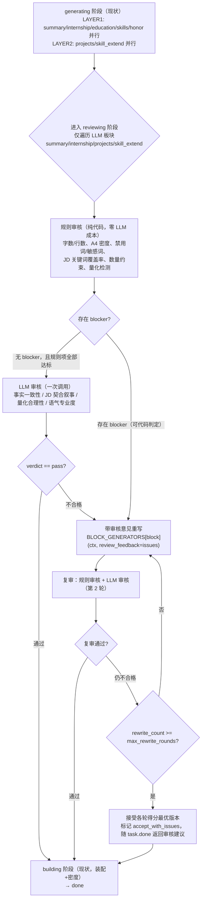

# JL-Agent 简历生成「生成 → 质量审核 → 不合格重写 → 复审」回路改造设计

> 项目：`D:\TRAE\WORKSPACE\JL-Agent\`（Python FastAPI，本地单用户 JSON 存储）
> 文档性质：改造设计（忠实于现行代码，引用真实函数名与行号；标注行号以 2026 年当前源码为准）
> 目标：对 LLM 生成的板块（summary / internship / projects / skill_extend）引入「审核 → 不合格带意见重写 → 复审」质量回路，纯规则板块（education / skills / honor）不受影响。

---

## 0. 结论速览（TL;DR）

1. **审核放哪**：新增第 4 个阶段 `reviewing`，插在现有 `generating` 与 `building` 之间（`dag.py` 的 `run()` 流程），只遍历 4 个 LLM 板块，`education/skills/honor` 完全不进入审核。
2. **怎么审**：混合审核 —— 先跑**规则项**（字数/行数、A4 密度、禁用词/敏感词、JD 关键词覆盖率、数量约束、量化检测，全部纯代码可查，零 LLM 成本），再跑 **LLM 审核项**（事实一致性、JD 契合叙事、量化合理性、语气与专业度）。
3. **不合格怎么办**：带审核意见调用**同一个板块生成函数**（`gen_fn(ctx, review_feedback=...)`）重写，复用其编辑锁定合并逻辑；复审 1 轮（`max_rewrite_rounds=1`，可配置 0~2），仍不合格则**接受各轮中得分最优版本**并标记 `accept_with_issues`，整单继续 → done。
4. **归属**：审核回路**留在项目内**（推荐），接口保持 `run_review(ctx)` 形态，未来可无痛迁移 LangGraph；HTTP 契约全部向后兼容，新增 2 个可选端点。

---

## 1. 现状精读

### 1.1 DAG 调度：`GenerationRunner`（app/engine/dag.py）

- 入口 `GenerationRunner.run(task_id)`（`dag.py:66`）：串行执行 `_prepare`（analyzing）→ `_generate`（generating）→ `_build`（building）→ `_finish`（done）；任何 `AppError` 收敛为 `_fail`（`dag.py:331`，任务 `failed`）。阶段常量 `STAGES = ["analyzing", "generating", "building"]`（`dag.py:29`）。
- `_prepare`（`dag.py:141`）：加载简历 → 从 `GenCache` 取 JD 分析事实表（`jd_key`，`cache.py:34`）或调 `JDAnalyzer.analyze` 重算 → 组装 `GenContext`（`base.py:14`）→ `deep_search=true` 时联网搜索（失败降级不阻塞）→ 推送 `block.done(analysis)` 并加 analysis 权重进度。
- `_generate`（`dag.py:212`）：按 `LAYER1`/`LAYER2`（`blocks/__init__.py:20-22`）两层 `asyncio.gather` 并行执行 `_run_block`。
- `_run_block`（`dag.py:228`）：推送 `block.progress` → 调 `BLOCK_GENERATORS[name](ctx)`（注册表 `blocks/__init__.py:9-17`）→ **任何异常（含 `AppError`）捕获后输出 `{"degraded": true, "error": ...}`** → 写入 `ctx.blocks[name]` → `budget.record_estimated`（自估行数，`budget.py:47`）→ 推送 `block.done`（带 `ok/degraded/skipped`）→ 非 skipped 加板块权重进度。
- `_build`（`dag.py:262`）：把 `ctx.blocks` 结果**回写简历**（summary.sentences / internship.items / project.projects / skill+skill_extend 合并去重 / honor）→ 写 `contentPlan`（`bullet_count_per_project` 由 `bullet_limit` 决定）→ `Assembler.render()` 产出 `html + config`（模板缺失 → `E_TEMPLATE` 致命失败）→ 保存简历 → 推送 `block.done(build)`。
- `_finish`（`dag.py:314`）：任务 `done`、`progress=1.0`，推送 `task.done`，载荷含 `html` 与 `config`（前端 `task.done` 回调直接渲染，`frontend/js/app.js:1242`）。
- 进度体系：`BLOCK_WEIGHTS`（`schemas/task.py:54-63`：analysis 0.15 / summary 0.10 / education 0.05 / internship 0.10 / skills 0.10 / projects 0.35 / skill_extend 0.05 / build 0.10）；`_relevant_weights`（`dag.py:123`）跳过本次不涉及的板块做归一化；`ZERO_WEIGHT_BLOCKS = {"honor"}`（`dag.py:27`）。

### 1.2 四个 LLM 板块的输入/输出契约（本轮审核对象）

| 板块 | 生成函数（文件:行） | 输入（取自 `GenContext`） | 输出契约 | 降级输出（`degrade`） | 编辑锁定处理 |
|---|---|---|---|---|---|
| 自我评价 | `gen_summary`（blocks/summary.py:6） | `brief_of(resume)`（base.py:88）+ `industry_rules` + `factsheet` | `{"sentences":[{"text","criticality","estimatedLines"}], "degraded"}`，**最多 2 句**（`summary.py:33` `sentences[:2]`） | `{"sentences": []}` | 用户 edited 句子（`s.get("edited")`）优先保留、置 `critical`，占满 2 句空位（`summary.py:16-21`）；LLM 只补充剩余空位 |
| 实习美化 | `gen_internship`（blocks/internship.py:37） | 用户 `internship` 原值 + `industry_rules` | `{"items":[{"company","position","startMonth","endMonth","overview","duties[]"}], "degraded"}`；`duties` 条数 = `limit`（一页 3 / 两页 4，`internship.py:42`） | `_degrade_internships`（`internship.py:6`）结构补齐（概述+保留原文职责，不虚构） | 已编辑职责保留原文置 `critical`（`internship.py:56-64`）；公司/职位/时间一律取用户原值（`internship.py:72-75`） |
| 项目生成 | `gen_projects`（blocks/projects.py:42） | `_pick_seeds`（种子，projects.py:10）+ `_skeleton`（骨架，projects.py:26）+ `factsheet` + `search_results`；条数 = `ctx.project_count`（`contentPlan.projectCount`） | `{"projects":[{"name","role","startMonth","endMonth","techStack","items[]","source","aiFlag"}], "degraded"}`；每项目 `items` ≤ `bullet_limit(page_option, count)`（projects.py:35：一页 4/3、两页 6/4）；总条数 `projects[:count]`（projects.py:111） | `{"projects": []}`，兜底补种子（projects.py:97-110） | 按项目名匹配保留 edited 要点（projects.py:51-54、72-78） |
| 技能拓展 | `gen_skill_extend`（blocks/skill_extend.py:48） | 用户 `skill` + `jobs`（JD）；仅 `skillExtend=true` 时执行（`dag.py:152` `skill_extend_enabled`） | `{"skills":[{"category","name","level"}], "degraded"}`；分类收敛 ≤5 类（`_coalesce_categories`，skill_extend.py:17） | `{"recommended": []}` → `{"skills": [], "degraded": true}` | 只追加不重复（`existing` 去重，skill_extend.py:60-73），不触碰用户技能 |

**公共设施**：`llm_with_degrade(provider, messages, *, max_tokens, temperature, degrade)`（base.py:45）—— `for attempt in range(2)`：`provider.chat(json_mode=True)` + `extract_json` 解析，失败重试 1 次，仍失败返回 `{**degrade, "degraded": True}`。所有 LLM 块共用该降级通道。`normalize_text_item`（base.py:73）夹取 text ≤500、`estimatedLines` 1~8。

### 1.3 纯规则板块（不进审核）

- `gen_education`（blocks/rules.py:15）：按 `endMonth` 倒序排序，无 LLM。
- `gen_skills`（blocks/rules.py:28）：去重 + 按固定分类顺序排序，无 LLM。
- `gen_honor`（blocks/rules.py:41）：保留原值/格式化时间，空则 `skipped`，无 LLM。
- 它们在 `LAYER1`（`blocks/__init__.py:20`）与 LLM 块并行，但产出直接来自用户数据，**审核阶段不遍历它们**。

### 1.4 现有失败重试 / 降级逻辑（§5.6 契约实现）

- 模块级：`llm_with_degrade` 重试 1 次 → 降级输出 `{"degraded": true, ...}`（base.py:45-59）；`_run_block` 再兜一层异常捕获（dag.py:239-242）→ 整单继续（非致命）。
- 搜索：`deep_search=true` 失败 → `ctx.search_degraded=True` 降级纯 LLM（dag.py:176-187）。
- 致命：事实表缺失/模板缺失 → `E_TEMPLATE` 等 `AppError` → `_fail` 任务 `failed`（dag.py:81-84、331-341）。
- **现状缺口**：降级只保证"有输出"，不保证"输出质量"——LLM 一次生成即落盘，无任何质量把关；`rules/projects/mapping.json:45-51` 已定义 `evaluation`（STAR 四要素齐备度 / JD 关键技能词覆盖率 / 真实性自洽 / 量化占比 / 字数范围）但**只在 prompt 里作为参考（`projects_messages` 第 5 层，prompts.py:250），没有任何代码消费**。

### 1.5 assembly 密度机制（app/engine/assembly.py）

- `Assembler.render(resume, blocks, *, density, watermark_mode)`（assembly.py:242）：按 `pageOption` 选模板（`TEMPLATE_FILES`，assembly.py:18）→ `_auto_density` 决定有效密度 → 逐板块拼 HTML → 产出 `(html, config)`，`config.blocks` 为自估行数基线（`_estimated_baseline`，assembly.py:441，仅 summary/internship/projects）。
- `_auto_density`（assembly.py:183）：`_content_usage`（assembly.py:68）按字号/行距/留白参数化模拟分页（`_LAYOUT`，assembly.py:26-55；`DENSITY_ORDER = ["compact","normal","loose"]`，assembly.py:19）→ 超出目标页数降档压缩、过空升档填充（assembly.py:194-213）。**这是"排版层"的密度兜底，只调档位、不删内容**。
- `_estimated_baseline`（assembly.py:441）依赖 `BudgetTracker.collect_estimated`（budget.py:32）—— 审核阶段可复用同一收集逻辑做"内容预算"粗判。

### 1.6 前端「编辑锁定 edited=true」如何与生成交互（§5.5）

- **落库**：`PUT /api/resume/{id}/item`（resume.py:152 `edit_item`）→ 改文本、`edited=true`、`criticality="critical"`；`POST /api/resume/{id}/item/unlock`（resume.py:169）→ `edited=false`。schema：`Duty.edited`（schemas/resume.py:65）、`ProjectItem.edited`（:82）、`SummarySentence.edited`（:88）。
- **展示**：`frontend/js/adapt.js` `markEdited()`（adapt.js:83）对照 resume 数据给 iframe 内 `[data-block]` 元素加「已锁定」虚线框 + 徽标；点击打开编辑弹窗（adapt.js:250）。
- **生成侧**：三个 LLM 块在合并输出时**跳过 edited 项的重写**——summary 先收 edited 句（summary.py:16-21）、internship 按来源公司保留 edited 职责（internship.py:56-64）、projects 按项目名保留 edited 要点（projects.py:72-78）。`E_EDITED_LOCK=40012`（core/errors.py:27）为预留错误码。
- **交互结论**：任何"重写"路径若复用各 `gen_*` 的合并逻辑，就**天然不会覆盖用户已编辑内容**；这是本设计把"重写"复用 `gen_fn(ctx, review_feedback=...)` 而不是另写重写器的根本原因。

### 1.7 事件 / 进度体系（可复用点）

- `_push(task_id, event, data)`（dag.py:94）持久化到 `task.events`；`GET /api/task/{id}/events`（generate.py:173）SSE 回放 + 轮询增量，直至 `done/failed/canceled`（generate.py:191）。
- `_set_stage`（dag.py:102）写 `state/stage/stageIndex/stageTotal`，`task.stage` 事件。前端 `openSSE`（app.js:1223）按 `stageIndex/stageTotal` 算进度条，`block.done` 显示"板块完成（降级）"。
- **结论**：新增 `reviewing` 阶段 + `block.review` 事件可零改造接入现有 SSE 协议（前端只需加一个中文映射，见 §4.2）。

---

## 2. 审核回路设计

### 2.1 总体流程（Mermaid）



### 2.2 审核粒度：**逐板块为主，整简历一致性为可选补充**

| 粒度 | 覆盖内容 | 是否触发重写 | 说明 |
|---|---|---|---|
| **逐板块审核（P0，必做）** | summary / internship / projects / skill_extend 各自独立审核 | 是（不合格板块单独重写） | 与现有"模块级失败隔离"（§5.6）哲学一致：单板块不合格不拖累其他板块；`asyncio.gather` 并行审核 4 块 |
| **整简历一致性审核（P1，可选）** | 跨板块核对：自我评价声称的能力是否被项目/实习支撑；技能 vs 项目技术栈是否自洽 | 否（仅 flag） | 整简历重写风险高（可能踩到其他板块已通过的版本、成本翻倍），首版只做**只读告警**，随 `task.done` 展示建议，用户可手动编辑锁定后自己改 |

**为什么逐板块而不是整简历**：① 每个板块的输入（用户原文/种子/factsheet）与输出契约独立，审核维度（§3）天然按板块定义；② 现有失败隔离与编辑锁定都是叶子级（`data-block/data-index/data-sub-index`，assembly.py:328/364/389），逐板块重写可精确复用；③ 整简历重写会使 LLM 上下文膨胀（factsheet+全量 resume+JD），且任一板块被用户锁定后整简历重写会变得不可执行。

### 2.3 重试上限与轮次预算

- `MAX_REWRITE_ROUNDS = 1`（默认，可配置 0~2）：至多重写 1 次、复审 1 轮，即每个板块最多 2 轮审核、2 次生成（含初次）。
- 轮次预算（每板块最坏 LLM 调用数）：

| 路径 | 调用序列 | LLM 调用数 |
|---|---|---|
| 一次通过 | 生成 → 规则审核（0 调用）→ LLM 审核 | 2 |
| 规则 blocker 直接重写后通过 | 生成 → 规则审核 → 重写 → 复审 | 3 |
| 全链路最坏 | 生成 → 审核 → 重写 → 复审 → 仍不合格（接受最优版） | 4 |

- 4 个 LLM 板块全链路最坏 = 16 次调用（现状 4 次）；典型通过路径 = 8 次。成本控制见 §6.2。
- **终止条件**：`rewrite_count >= MAX_REWRITE_ROUNDS` 或复审 `pass`；任何一轮 LLM 审核自身异常 → 视为 pass（不阻塞流水线，记录 `review.degraded` 事件）。

### 2.4 审核在 DAG 中的位置：新增 `reviewing` 阶段

- 位置：`run()`（dag.py:66-80）中 `await self._generate(ctx)` 之后、`await self._build(ctx)` 之前插入 `await self._review(ctx)`。
- 阶段常量：`STAGES = ["analyzing", "generating", "reviewing", "building"]`（dag.py:29 改造）；`TaskState` 枚举增加 `reviewing`（schemas/task.py:10-19 改造，注意 `_set_stage` 会把 `state` 与 `stage` 同写，dag.py:102-111）。
- **不影响纯规则板块**：`_review(ctx)` 只遍历 `REVIEWABLE_BLOCKS = {"summary", "internship", "projects", "skill_extend"}`；`education/skills/honor` 不进入任何审核函数；`honor` 仍为 `ZERO_WEIGHT_BLOCKS`（dag.py:27）。
- **跳过条件**（与现有降级衔接）：`output.get("degraded")` 或 `output.get("skipped")` 的板块 → 不跑 LLM 审核（降级输出已是最差回退，再重写收益低），只跑规则审核并接受；规则 blocker 仅记录告警。
- 进度：`BLOCK_WEIGHTS` 增加 `"review": 0.05`（schemas/task.py:54-63），`_relevant_weights`（dag.py:123）纳入；`_review` 结束时一次性加 `review/total` 进度（仿 analysis 的写法，dag.py:189-197），每板块审核过程通过 `block.review` 事件推送（仅 UI 进度用，不加权重，保证 0→1 单调）。

### 2.5 状态机与事件扩展（兼容现有 SSE）

| 事件 | 载荷 | 前端现有处理（app.js） | 新增处理 |
|---|---|---|---|
| `task.stage`（stage="reviewing"） | {taskId, stage, stageIndex:2, stageTotal:4} | 通用显示 `阶段：reviewing`（app.js:1231） | 建议加中文映射 `reviewing → 审核中`（可选，不加也能跑） |
| `block.review`（新增） | {taskId, block, round, verdict, score, issueCount, rewritten} | 无 | 显示 `审核板块：xxx（第 n 轮 · 通过/需重写）` |
| `task.done` | 现有 {html, config,...} 增加 `review` 摘要 | 渲染 html（app.js:1242-1269） | 可选：展示审核建议横幅（P1） |

### 2.6 与现有降级 / 编辑锁定的衔接

- **重写复用生成函数**：`rewrite_block(ctx, name, issues)` = `BLOCK_GENERATORS[name](ctx, review_feedback=formatted_issues)`——同一函数、同一合并逻辑，自动继承：edited 保留（summary.py:16-21 / internship.py:56-64 / projects.py:72-78）、数量约束（`bullet_limit`、`projects[:count]`、duties `[:limit]`）、`estimatedLines` 协议、降级兜底。**不新增第二条"无锁定保护"的重写路径**。
- **降级板块**：不重写（§2.4 跳过条件）。
- **重写后的产物**：写回 `ctx.blocks[name]`（替换旧输出，附带 `review` 元数据），`_build`（dag.py:262）无需改动即可装配新版本。

---

## 3. 审核标准设计（混合审核）

### 3.1 总览

```
规则审核（代码，零 LLM 成本）─────────────┐
  ① 字数范围  ② A4 密度约束  ③ 禁用词/敏感词    ├─→ blocker 存在 → 直接进入重写（不调 LLM）
  ④ JD 关键词覆盖率  ⑤ 数量约束  ⑥ 量化检测     │     （省 1 次 LLM 调用）
───────────────────────────────────────┘
LLM 审核（每板块 1 次调用，max_tokens≈1024）──┐
  ⑦ 事实一致性（不编造）  ⑧ JD 契合叙事          ├─→ fail（存在 ≥1 blocker 且 score < 阈值）
  ⑨ 量化成果合理性  ⑩ 语气与专业度               │      → 带意见重写 → 复审
───────────────────────────────────────┘      ┘
```

### 3.2 规则审核项（全部可代码实现，零 LLM 成本）

| # | 检查项 | 判定逻辑（实现要点） | 数据来源 / 复用 |
|---|---|---|---|
| ① | 字数范围 | summary 句 20~120 字（prompt 标准 40~80，`summary_messages` prompts.py:137，放宽容差）；duty 15~300 字；project item 20~500 字；overview ≤200 字；`estimatedLines` 1~8（`clamp_estimated` base.py:65 已夹取，超限即异常） | 输出 JSON + `normalize_text_item` |
| ② | A4 密度约束 | 把 `ctx.blocks` 结果回填到 resume 副本（复用 `_build` 的回写映射，dag.py:267-280），调用 `assembly._content_usage`（assembly.py:68）模拟分页：`pages > 目标页数`（一页 1 / 两页 2）→ **blocker**（内容预算超限，重写时提示精简）；`pages == 目标但 lastFill < 0.35` → minor | `_content_usage` + `_LAYOUT`（assembly.py:26-55） |
| ③ | 禁用词/敏感词 | 一/二人称（我、我们、我的）；绝对化表述（保证、100% 完成、绝对、精通所有、遥遥领先）；占位符残留（待补充、xx、TODO、【】内未替换）；配置化 `FORBIDDEN_WORDS` 表（config.json `review.forbiddenWords`），命中 → blocker/minor 按词表分级 | 正则 + 配置 |
| ④ | JD 关键词覆盖率 | 生成文本（summary 句 + internship duties + project items）对 `factsheet.coreSkills` 命中率，复用 `analysis._keyword_coverage`（analysis.py:108-118）思路；`< min_keyword_coverage`（默认 0.6）→ blocker | `factsheet.coreSkills`（schemas/jobs.py:35）+ 输出文本 |
| ⑤ | 数量约束 | summary 1~2 句（summary.py:33）；internship 每段 duties 数 == `limit`（3/4，internship.py:42）；projects 条数 == `project_count` 且每项目 items 数 == `bullet_limit`（projects.py:35-39）；skill_extend 分类 3~5（skill_extend.py:32-41 已收敛，复核即可） | 输出 JSON + `bullet_limit` |
| ⑥ | 量化检测 | 每条 duty / project item 至少命中 1 个量化模式：`\d+(\.\d+)?%`、`\d+(\.\d+)?\s*(ms|s|秒|QPS|万|亿|倍|人|个|行|项)`、关键词（提升/降低/达/降至/准确率/召回率/覆盖率/吞吐/延迟/成本）；**0 命中 → blocker**（prompt 已要求"每条必须含量化成果"，internship_messages prompts.py:158） | 正则 |
| ⑦ | 结构完整性 | internship 每项含 `overview`+`duties`；projects 每项含 `name`/`techStack`/`items` 且首条含基线数字（STAR 的 S 段）；缺失 → blocker | 输出 JSON 结构校验 |

**分级规则**：blocker（①严重超限 / ②溢出 / ③命中高敏词 / ④覆盖率不足 / ⑤数量不符 / ⑥无量化的条目 / ⑦结构缺失）→ 触发重写；minor（字数轻微越界、覆盖率临界、语气）→ 仅记录，默认不触发重写（可配置 `minor_triggers_rewrite`）。

### 3.3 LLM 审核项

| # | 维度 | 审核要点（提示词核心） | 判定示例 |
|---|---|---|---|
| ⑦ | **事实一致性**（最高优先级） | 与用户原始输入比对：polished 内容不得新增用户未提供的职责方向/公司/职级/时间；ai-created 项目必须为课程/竞赛/自研等可验证类型，不得虚构公司/机构/职级；不得与用户已填数字冲突 | 用户实习只有"前端页面开发"，输出却写"主导大模型微调" → blocker；项目 source=ai-created 却出现"字节跳动实习" → blocker |
| ⑧ | **JD 契合叙事** | 呼应 `factsheet.coreSkills` 2~3 项与 `jdFocus`（prompts.py:116-120 的呼应要求），不逐条罗列；summary 与 JD 方向匹配 | 目标岗"AI Agent"，summary 全篇讲"财务核算" → blocker |
| ⑨ | **量化合理性** | 数值符合行业常规精度（对照 `industry.metric_style`，rules/industries/*.json:9）；无极端值；百分比 1 位小数；实习生场景规模/时延在合理量级 | "延迟提升 500%"、"QPS 10 万"（实习生单项目）→ blocker；"准确率 71%→89%" → 合理 |
| ⑩ | **语气与专业度** | 无口语/第一人称/空泛形容词（大大提高、非常优秀）；动词开头（负责/搭建/实现/优化）；符合 `industry.tone`（rules/industries/*.json:10） | "我做得很好" → blocker；"搭建了 XX 系统" → 通过 |

### 3.4 审核提示词要点（新增 `review_messages`，置于 prompts.py）

沿用现有"八层结构"（prompts.py 头部注释）：系统人设（第 1 层）+ 简历数据（第 2 层）+ JD/事实表（第 3~4 层）+ 规则与风格（第 5 层）+ 输出格式（第 6 层）+ 合规边界（第 8 层）。

```
【系统】（第 1 层）你是资深 HR 与简历审核员。坚持「真实优先」：识别编造事实是最高优先级的错误；
            输出严格 JSON，不做任何解释。
【被审内容】（第 2 层）当前板块输出 JSON（block=summary|internship|projects|skill_extend）
【共享事实表】（第 4 层）direction / coreSkills / jdFocus / metricStyle / keywordCoverage
【规则与风格】（第 5 层）industry.tone / metric_style / evaluation 清单（mapping.json:45-51 的 5 条）
【用户原始输入】（第 2 层补充）brief_of 摘要 / 原实习 duties / 种子项目（用于事实比对）
【已编辑锁定清单】（第 2 层补充）edited=true 的条目原文 —— 禁止对它们提出任何修改建议
【输出格式】（第 6 层）
{"verdict":"pass|fail","score":0.0~1.0,
 "issues":[{"severity":"blocker|minor","category":"事实一致|JD契合|量化|语气|字数|密度|禁用词|关键词覆盖|数量|结构",
            "message":"具体到第几条的什么问题","suggestion":"可执行的改写方向（不代写）"}],
 "summary":"一句话总评"}
【合规边界】（第 8 层）不得虚构、不得修改用户已编辑项、审核意见必须具体可执行、verdict=pass 仅当无 blocker。
```

**重写反馈提示词要点**（`rewrite_feedback_text`，追加到原板块 user 消息末尾）：
```
【上轮审核意见（必须逐条响应）】
- [blocker] 第 2 条职责缺少量化成果 → 补 1 个符合 metric_style 的数字
- ...
【硬约束】不改变公司/职位/时间等事实；保留用户已编辑条目原文；维持数量约束
（bullet_limit / project_count）；继续遵守自估协议（estimatedLines 1~8）；不要引入新问题。
```

### 3.5 审核结果数据结构（新模块 review.py 内定义）

```python
@dataclass
class ReviewIssue:
    severity: str        # "blocker" | "minor"
    category: str        # 字数|密度|禁用词|关键词覆盖|数量|量化|结构|事实一致|JD契合|语气
    message: str         # 具体到第几条
    suggestion: str      # 可执行改写方向

@dataclass
class ReviewResult:
    block: str
    verdict: str         # "pass" | "fail" | "accept_with_issues"
    score: float         # 0~1（LLM 审核分；规则 blocker 时=0）
    issues: list[ReviewIssue]
    rounds: int          # 已执行审核轮数（1 或 2）
    rewritten: bool
    best_output: dict    # 各轮中 score 最高的输出版本（防重写回退）
```

---

## 4. 具体改动点

### 4.1 新增模块 `app/engine/review.py`（核心，约 300 行）

| 成员 | 职责 | 关键实现 |
|---|---|---|
| `REVIEWABLE_BLOCKS = ("summary", "internship", "projects", "skill_extend")` | 审核范围常量 | 与 `BLOCK_GENERATORS`（blocks/__init__.py:9）对齐 |
| `check_rules(ctx, block, output) -> list[ReviewIssue]` | §3.2 六项规则审核（纯代码） | 复用 `BudgetTracker.collect_estimated`（budget.py:32）、`_content_usage`（assembly.py:68）、`_keyword_coverage` 思路（analysis.py:108）；正则表 + `config.review.forbiddenWords` |
| `llm_review(ctx, block, output, round_no) -> ReviewResult` | §3.3 四项 LLM 审核 | `provider.chat(review_messages(...), json_mode=True, max_tokens=1024, temperature=0.2)`；解析失败/异常 → 返回 `verdict="pass"` + `review_degraded=True`（不阻塞） |
| `rewrite_block(ctx, block, issues) -> dict` | 带意见重写 | `BLOCK_GENERATORS[block](ctx, review_feedback=rewrite_feedback_text(block, issues))`；输出写回 `ctx.blocks[block]` |
| `review_block(ctx, block) -> ReviewResult` | 单板块审核循环（规则 → LLM → 重写 → 复审，≤MAX_REWRITE_ROUNDS） | 维护 `best_output`/`best_score`；复审仍 fail 且轮次用尽 → 接受最优版 `accept_with_issues` |
| `run_review(ctx) -> dict` | 阶段编排 | `asyncio.gather` 并行审核 4 块；跳过 `degraded/skipped`；推进度（`BLOCK_WEIGHTS["review"]/total`）；推送 `block.review` 事件；汇总 `reviewSummary` 供 `task.done` |

### 4.2 文件级 + 函数级改动清单

| 文件 | 改动点 | 改动内容 | 量 |
|---|---|---|---|
| `app/engine/review.py` | **新增** | §4.1 全部成员 | +300 |
| `app/engine/prompts.py` | 新增 `review_messages()`、`rewrite_feedback_text()`；4 个生成函数（`summary_messages` L110 / `internship_messages` L143 / `projects_messages` L184 / `skill_extend_messages` L78）增加可选 `review_feedback` 参数并在 user 消息末尾追加【上轮审核意见】 | 审核/重写提示词（沿用八层结构） | +120 |
| `app/engine/blocks/base.py` | `GenContext`（L14）增加 `review_config: dict = field(default_factory=dict)`（或直接读 `ctx.config`，二选一） | 上下文透传审核配置 | +2 |
| `app/engine/blocks/summary.py` | `gen_summary(ctx, review_feedback=None)`（L6）：`summary_messages(..., review_feedback)`；合并逻辑**不改** | 重写复用 | +3 |
| `app/engine/blocks/internship.py` | `gen_internship(ctx, review_feedback=None)`（L37）：同上 | 重写复用 | +3 |
| `app/engine/blocks/projects.py` | `gen_projects(ctx, review_feedback=None)`（L42）：同上 | 重写复用 | +3 |
| `app/engine/blocks/skill_extend.py` | `gen_skill_extend(ctx, review_feedback=None)`（L48）：同上 | 重写复用 | +3 |
| `app/engine/dag.py` | `STAGES`（L29）加 `"reviewing"`；`run()`（L66-80）在 `_generate` 后插 `await self._review(ctx)`；新增 `_review(ctx)`（调 `review.run_review`，加进度）；`_relevant_weights`（L123）纳入 `"review"`；`_finish`（L314）的 `task.done` 载荷加 `review` 摘要 | 阶段接入 | +70 |
| `app/schemas/task.py` | `TaskState`（L10-19）加 `reviewing`；`BLOCK_WEIGHTS`（L54-63）加 `"review": 0.05`；可选新增 `ReviewIssue`/`ReviewResult` 序列化模型 | 状态/权重 | +15 |
| `app/config.py` | 新增 `ReviewCfg` dataclass（enabled/max_rewrite_rounds/llm_review/min_keyword_coverage/accept_score/forbidden_words/...）+ `Config.review`（L42-47）+ `load_config` 解析（L54-78） | 配置化阈值与开关 | +20 |
| `config.json` / `config.example.json` | 新增 `"review": {...}` 段 | 阈值/词表/开关（避免硬编码） | +15 |
| `app/api/generate.py` | 基本不动（`build_runner` 已注入 config）；可选新增 `POST /api/review` | 按需复审 | +25（可选） |
| `app/api/resume.py` | 可选新增 `POST /api/resume/{id}/review`（用户手动编辑后按需全量复审，跳过 edited 项） | 编辑后复审 | +30（可选） |
| `frontend/js/app.js` | `task.stage` 映射 `reviewing → 审核中`（L1227-1232）；监听 `block.review` 显示审核进度（L1233-1241）；`task.done` 后可选展示审核建议横幅 | 前端联动 | +40 |
| `tests/logic_check.py` / `tests/smoke_api.py` | 新增用例：规则审核纯函数单测（禁用词/量化/关键词覆盖）、重写保留 edited、复审轮次上限、`reviewing` 阶段 SSE 事件 | 回归 | +150 |

**合计约 700~800 行（含测试与可选端点），核心必做项约 550 行。**

### 4.3 改动量估算

| 阶段 | 内容 | 工作量 |
|---|---|---|
| M1 | review.py 规则审核（无 LLM）+ dag 接入 reviewing 阶段 + 配置 | 0.5~1 人日 |
| M2 | LLM 审核 + 重写回路（4 个 blocks 加 `review_feedback`）+ prompts | 0.5~1 人日 |
| M3 | 阈值校准（用真实简历回归集调 `min_keyword_coverage`/字数容差/词表，防误判）+ 前端展示 + 按需复审 API | 1 人日 |
| M4（可选） | LangGraph 适配器（§5.3） | 1~2 人日 |
| 合计 | | 2~4 人日（M1~M3 必做 2~3 人日） |

---

## 5. LangGraph 集成接口

### 5.1 现状 HTTP 契约（本次改造**不破坏**，全部向后兼容）

| 端点 | 方法 | 用途 | 现状实现 |
|---|---|---|---|
| `/api/generate` | POST | 提交关卡 → 创建 pending 任务 → 后台 `build_runner(app).run(task.id)` | generate.py:47-132 |
| `/api/task/{task_id}` | GET | 任务快照（state/progress/stage/stageIndex/stageTotal/error） | generate.py:135 |
| `/api/task/{task_id}/cancel` | POST | 取消（非终态） | generate.py:154 |
| `/api/task/{task_id}/events` | GET | SSE 回放 + 增量 | generate.py:173 |
| `/api/adjust` | POST | 适配闭环（≤3 轮密度收敛） | adjust.py:70 |
| `/api/resume/{resume_id}/export` | GET | 导出 json/docx/md/html（pdf 由前端打印） | resume.py:316 |

**新增（可选）**：`GET /api/task/{task_id}/review`（审核明细：各板块 verdict/score/issues/rounds）；`POST /api/resume/{resume_id}/review`（用户手动编辑后按需复审，跳过 edited 项）。两者都只读/只写已有 resume+task 数据，不改变现有端点语义。

### 5.2 审核回路归属决策：**留在项目内（推荐）**

理由（基于对现有代码的精读）：

1. **现有架构已是"手写 DAG + 状态机"**：`GenerationRunner` 以 `GenContext` 串行推进 3 个阶段，`task.events` 持久化 + SSE 回放已等价于 LangGraph 的 checkpoint 语义（dag.py:94-115、generate.py:173）；审核回路只是在这个既有编排里加一个阶段和一个小循环，**不产生新的编排复杂度**。
2. **单用户本地串行环境**：无并发/多租户/断点续跑需求；LangGraph 的图状态管理、checkpointer、中断恢复在这里没有增量价值，反而引入新依赖与序列化边界（`GenContext` 含 provider/storage 等运行时对象，不能直接进 graph state）。
3. **成本与可控性**：审核阈值、词表、轮次上限需要随本地数据反复校准（M3），留在项目内改 `config.json` 即可；迁到 LangGraph 会多一层状态搬运与调试成本。
4. **官方文档的路线图印证**：`docs/JL技术文档.md:199` 建议的演进方向是"插件化「取材 → 生成 → 审核」三阶段钩子"，即**在项目内做审核**，而非引入外部编排框架。

**落地约束（为未来迁移留门）**：审核编排收敛为单一入口 `review.run_review(ctx)`，不散落在 dag.py 各处；`ReviewResult`/`ReviewIssue` 为纯数据（可 JSON 序列化），`ctx.blocks[block]["review"]` 元数据可随简历落库。

### 5.3 若迁移 LangGraph（M4 可选，适配器形态）

- **图定义**：
  ```
  generate_block(block) → review_block(block) → [fail] → rewrite_block(block, issues)
      → re_review_block(block) → [fail & rounds<max] → rewrite_block
      → [pass 或 rounds 用尽] → accept_block(block) → …（4 块并行同构子图）
      → build → done
  ```
- **State 契约**：`GraphState` = `GenContext` 的 JSON 子集（`{task_id, resume, jobs, factsheet, blocks, review_results, page_option, config}`）+ `rounds: {block: int}`；运行时对象（provider/storage/cache/budget）不进 state，由节点闭包注入。
- **Checkpoint**：LangGraph checkpointer 写 `data/langgraph/{thread_id}/checkpoint.json`，与现有 `task.events` 并存；`GET /api/task/{id}/events` 仍读 `task.events`（回放语义不变）。
- **接入方式**：`config.json` 增加 `langgraph: {enabled: false}`；`build_runner` 按开关选择 `GenerationRunner` 或 `LangGraphRunner`（后者实现相同 `run(task_id)` 接口）；HTTP 层零改动。
- **建议**：仅在出现"多用户并发、人工审核（human-in-the-loop）审批、断点续跑"等真实需求时再迁移；当前不做。

---

## 6. 风险与降级

### 6.1 审核误判（好简历被退回）

| 风险 | 场景 | 缓解措施 |
|---|---|---|
| 规则误杀 | 好内容因字数略超/关键词覆盖率临界被标 blocker | 规则阈值**放宽**（字数用 20~120 而非 prompt 的 40~80；覆盖率默认 0.6 且可配置）；只有**明确违反数量约束/A4 溢出/命中高敏词**才是 blocker；其余降级为 minor 不触发重写 |
| LLM 审核过严 | 合格内容被判 fail | 双门槛：`verdict=fail` 需 **score < accept_score（默认 0.75）且存在 ≥1 blocker**；minor-only → `accept_with_issues` 不重写；审核提示词强调"只有明确问题才算 blocker，宁松勿紧" |
| 重写劣化 | 重写后引入新问题 | 每轮记录 `best_score`，复审后 score 未提升 → **回退最优版本**（`best_output`）；轮次上限兜底 |
| 用户不信任 | 自动重写打扰用户 | 审核建议随 `task.done` 完整返回，前端展示"审核建议"横幅；用户可自行决定是否手动修改（手动修改即编辑锁定，后续生成不再触碰）；`config.review.enabled=false` 一键关闭（退化到现状行为） |

### 6.2 成本

- **LLM 调用预算**：一次通过 2 次/板块（生成+审核）、最坏 4 次/板块；4 板块最坏 16 次 vs 现状 4 次。缓解：① 规则 blocker 直接重写**省 1 次审核调用**；② LLM 审核 `max_tokens=1024`、`temperature=0.2`（低随机、短输出）；③ 轮次上限 1；④ 审核结果随输入哈希进 `GenCache`（复用 `block_key`，cache.py:38，P2 优化）；⑤ `docs/contract.md:305` 已注明默认模型 DeepSeek-V4-Flash 成本低，"可支撑多次估算/校准迭代"。
- **延迟**：最坏路径每板块多 2~3 次调用（约 +6~15s/板块，视 provider）；SSE `block.review` 事件保证前端进度可见，体验可接受。

### 6.3 与「编辑锁定」的交互（重点）

1. **规则审核跳过 edited 项**：`check_rules` 对 `edited=true` 条目只做只读统计（不判字数/量化/语气），命中问题最多记 minor 且**不进入重写触发条件**（用户原文是"用户主权"）。
2. **LLM 审核禁止建议 edited 项**：`review_messages` 输入携带 edited 清单，提示词第 8 层硬约束"不得对已编辑条目提出任何修改建议"。
3. **重写天然保留 edited**：重写走 `BLOCK_GENERATORS[block](ctx, review_feedback)`，复用现有合并逻辑（summary.py:16-21 / internship.py:56-64 / projects.py:72-78），**edited 原文不会被覆盖**——这是本设计选"复用生成函数"而非"独立重写器"的核心理由。
4. **用户编辑后再生成**：生成流程照旧，审核只针对本轮 LLM 新产出的非 edited 内容；可选 `POST /api/resume/{id}/review` 支持用户手动编辑后按需复审。
5. **降级板块**（`degraded/skipped`）：不进审核重写，避免在已经失败的板块上再烧钱（§2.4）。

### 6.4 其他风险

| 风险 | 缓解 |
|---|---|
| LLM 审核调用自身失败（provider 异常/JSON 解析失败） | 视为 `pass` + `review.degraded` 事件，**不阻塞流水线**（与 `llm_with_degrade` 的降级哲学一致，base.py:45） |
| 审核阶段被取消 | `run_review` 每块前检查 `_canceled(task_id)`（复用 dag.py:91 模式）；`reviewing` 状态天然可取消（cancel_task 只拦终态，generate.py:159） |
| 与 `/api/adjust` 的交互 | 审核在 building **之前**（预算级粗判），适配在 building **之后**（前端实测级精调，adjust.py:70），两者分层不冲突；审核的 A4 检查只拦截"内容预算明显超限"，密度收敛仍由适配闭环负责 |
| 审核结果丢失 | `block.review` 事件持久化到 `task.events`（SSE 回放可查）；审核摘要随 `task.done` 返回；`ctx.blocks[block]["review"]` 随简历落库（可选） |

---

## 附：与既有设计文档的呼应

- `docs/contract.md §5.6`（L321-325）"模块级失败隔离"——审核是"质量级隔离"的延伸：失败隔离保证**有输出**，审核回路保证**输出合格**。
- `docs/contract.md §5.5`（L315-319）编辑锁定——本设计全程尊重 `edited=true` 主权。
- `docs/JL技术文档.md:208` "端到端评测体系"建议（输出 → 规则校验 → 人工评分回归集）——本设计的规则审核项可直接沉淀为该回归集的第一层自动化。
- `rules/projects/mapping.json:45-51` 的 `evaluation` 五条 —— 本设计 §3.2/§3.3 的审核维度即其落地（① 字数=①，② JD 关键词覆盖率=④，③ 真实性自洽=⑦，④ 量化占比=⑥⑨，⑤ STAR 四要素=⑦ 结构）。
