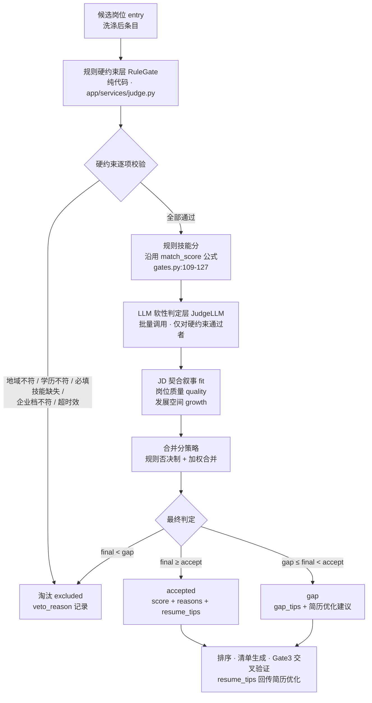
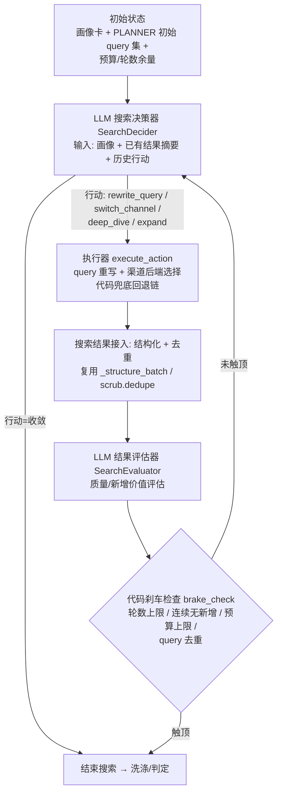

# JS-Agent 混合判定 + 搜索 Agent 回路 改造设计

> 项目：`D:\TRAE\WORKSPACE\JS-Agent`（Python FastAPI + LLM-Agent，v0.2.0）
> 目标：① 匹配判定改为「混合」——硬约束保留代码规则、软性维度引入 LLM 判断、规则否决制合并；② 搜索环节加 LLM 决策回路（决策搜索词 / 评估结果质量 / 决定收敛），原「写死的多级回退」重构为「LLM 选择的行动 + 代码兜底」。
> 本文所有函数名/行号均以当前代码为准（阅读于 2026-02，`app/` 全量 22 个 py 文件 + `rules/` + `config.example.json`）。

---

## 0. 核心结论（速览）

1. **Gate2 现状是纯规则**：`app/core/gates.py::CollectionGate.judge()`（行 129）用技能本体 id 重叠率打分（`score = 100*|matched|/|jd_ids|`，行 143），配合 `match_accept=80 / match_gap=60` 阈值（行 170-179）、企业五档过滤（行 146-151）、60 天时效（行 153-164）。**硬约束存在三处空缺**：无地域校验、无学历校验、无「必填技能」一票否决；且 `roles.json`（岗位本体，含 `required_skills`+权重）被加载但**从未参与判定**（`catalog.match_role` 无调用方）。这些空缺正是混合判定层要补的。
2. **搜索循环是写死的两段**：`app/agent/loop.py` 行 210-277 的 while 循环（每轮 2 条 query、连续 2 轮 <2 新增收敛、`≥max_results*2` 达标提前停）+ 行 309-342 的「≥90 分触发扩散」模板 query。多级回退链在 `app/plugins/search.py::SearchPlugin.search()`（行 386）内，真实优先级：智谱 → Tavily(有 Key 才启用) → 百度 → Playwright(装了才有) → 360 → DDG → Bing，失败进 120s 冷却（行 340/400）。
3. **LLM 调用点共 5 处**，全部走 `app/core/llm.py::LLMClient.chat_json()`（行 123）：画像解析 `PROFILE_SYSTEM`、搜索规划 `PLANNER_SYSTEM`、洗涤结构化 `STRUCTURE_SYSTEM`、清单生成 `LIST_SYSTEM`、质检修正 `REVIEW_SYSTEM`。匹配判定（Gate2）当前**不调用 LLM**，深判只是抓正文前 1500 字后重跑同一套规则（loop.py 行 302-306）。
4. **改造形态**：新增 `app/services/judge.py`（混合判定服务）与 `app/agent/search_loop.py`（搜索回路状态机）；**搜索 Agent 不引入 LangGraph**（项目零 LangGraph 依赖、循环是单 Agent 顺序循环，代码循环即可表达，理由见 §5.2）；HTTP API 契约保持不变，仅新增可选入参与一个 trace 接口。

---

## 1. 现状精读（忠实于实际代码）

### 1.1 整体架构与 9 步流程

入口 `app/main.py`：FastAPI 挂载 `match_router`（`app/api/match.py`）与 `console_router`，启动时探测搜索通道（行 29-36）。

匹配流水线由 `app/agent/loop.py::MatchRunner.run()`（行 182-367）编排，进度权重 `STEP_WEIGHTS`（行 30）：profile 5 / plan 5 / search 55 / scrub 5 / judge 5 / expand 5 / list 10 / review 5 / save 5——**搜索占 55%**，说明搜索环节是耗时大头，也是回路改造收益最大的地方。

| 步骤 | 代码位置 | 说明 |
|---|---|---|
| ① 画像解析+Gate1 | `run()` 行 198-203 → `_parse_profile()` 行 371-385 | `llm.chat_json(PROFILE_SYSTEM,…)` 行 378，`profile_gate.validate` 行 379，重试 `profile_retry` 次 |
| ② 搜索规划 | 行 205-208 → `planner.build_queries()` | LLM 生成 ≥3 条 query，见 §1.4 |
| ③ 搜索循环 | 行 210-277 | while 循环 + 收敛控制，见 §1.3 |
| ④ 洗涤去重 | 行 279-282 | `scrub.normalize` + `scrub.dedupe`（title+company 去重，`app/plugins/scrub.py` 行 31-42） |
| ⑤ 判断 Gate2 | 行 284-292 | 逐条 `collection_gate.judge()`，见 §1.2 |
| ⑥ 深判 | 行 294-307（仅 `mode=="match"`） | 非灰区 URL 抓正文，`jd_text=text[:1500]` 后重跑 `judge()` |
| ⑦ 扩散 | 行 309-342 | 存在 `match_score≥match_expand(90)` 时追加一条模板 query |
| ⑧ 排序 | 行 344-346 | `accepted.sort(key=(-match_score, updated_at))`，截 `[:max_results]` |
| ⑨ 清单生成+Gate3 | 行 348-351 → `_generate_list()` 行 387-439 | `LIST_SYSTEM` 生成 + `output_gate` 校验 + `REVIEW_SYSTEM` 修正循环 |
| ⑩ 保存 | 行 353-357 | `writer.save` 落盘 md/html 到 `output/` |

> ⚠️ 重要事实：`app/api/match.py::start_match()`（行 30）构造的 request（行 57-65）**不传 `mode`**，`run()` 行 193 `mode = request.get("mode") or "scout"`，所以当前 API 默认走 **scout 模式**：Gate2 照常打分，但收录只看 `is_job`（`_collect_mode` 行 172-176），深判/80% 收录门槛是 match 模式代码路径，默认不触发。改造时需注意：混合判定应同时服务两种模式（分数用于排序/收录），避免模式分叉。

### 1.2 Gate2 匹配判定完整逻辑（`app/core/gates.py`）

类 `CollectionGate`（行 97），核心三件套：

**① 打分：技能本体 id 重叠率**（`match_score()` 行 109-127，`judge()` 行 138-143 复算）

```python
hits = catalog.match_skills(jd_text)        # providers.py:141，全量小写索引子串/词边界匹配
jd_ids   = [h["skill"]["id"] for h in hits] # JD 中出现的核心技能 id（去重）
profile_ids = self._profile_ids(profile_skills, profile_implicit)  # gates.py:101，画像技能→本体 id 集合
matched = [name for name, sid in zip(jd_skills, jd_ids) if sid in profile_ids]
score = round(100.0 * len(matched) / len(jd_ids), 1)   # 分子=画像命中 JD 的技能数，分母=JD 技能总数
```

- 机制：JD 文本 → `providers.RuleCatalog.match_skills`（行 141-152）命中技能本体（`rules/skills.json` 的 `id/aliases/keywords` 全量小写索引，纯 ASCII 词用词边界防 "llm" 误命中 "vllm"，行 133-139）。画像侧 `_profile_ids`（行 101-107）把画像技能名 + 隐含技能（`implicit_skills` 行 74-89，仅推理线加分）映射到同一套 id 集合，两侧按 id 比对，避免名称差异失配。
- 已知弱点：分母是 JD 技能总数，JD 罗列技能越多分越低；只认本体词表，JD 用新词（如 "deepseek-r1 蒸馏" 未收录）不计分。

**② 阈值使用**（`judge()` 行 170-179，阈值来自 `config.CONSTRAINT_PRESETS`，`app/config.py` 行 151-185，strict 档）：

```python
accept = config.constraints["match_accept"]   # strict=80
gap    = config.constraints["match_gap"]      # strict=60
if score >= accept:  status="accepted"
elif score >= gap:   status="gap"; gap_tips=f"匹配度 {score}%（<80%），需补足技能：…"
else:                status="excluded"; exclude_reason=f"匹配度 {score}% 低于 60% 阈值"
```

**③ 企业五档过滤**（`judge()` 行 146-151 + `app/core/enterprise.py::EnterpriseClassifier.classify()` 行 58-98）：`classify` 优先级 央企(国资委名录)→国企(关键词)→大型(员工>5000/500强)→中型(含独角兽)→小型→未知；`judge` 中 `etype != "未知" and etype not in selected_types` → 直接 `excluded`。

**④ 时效规则**（`judge()` 行 153-164）：`fresh_days=60`（strict），`updated_at` 可解析为 `YYYY-MM-DD` 且距今 >60 天 → `excluded`。**注意：无日期字段的岗位不判时效**（宽松兜底）。

**⑤ 硬约束空缺（改造重点）**：
- ❌ **无地域校验**：`judge()` 全程不读 `city`；地域只体现在 planner 注入 query 前缀（planner.py 行 71-74）。
- ❌ **无学历校验**：`degree` 字段只被洗涤提取并透传（loop.py 行 261），`judge()` 不使用；`rules/roles.json` 的 `education` 列表未参与。
- ❌ **无「必填技能」一票否决**：只有分数阈值，画像 `confirmed=true` 的核心技能在 JD 完全缺失时，只要其他技能多也能过 60 分。
- ❌ **roles.json（岗位本体）未参与判定**：`providers.py` 加载了 `roles`（行 51）并实现 `match_role`（行 154），但**全工程无调用方**（grep 证实），`required_skills`/权重体系闲置。

**Gate3**（`OutputGate`，行 192-219）：`validate_job` 必填 `title/match_score/skill_line/missing_skills/source_url`（source_url 必须 http 开头防编造，行 208）；`cross_check` 行 212-219 对 LLM 打分与规则分偏差 >15 报错——**这是现成的一条「LLM vs 规则」一致性护栏，混合判定可直接复用**。

### 1.3 搜索循环实现

**① 多级回退链**（`app/plugins/search.py`）：`SearchPlugin.refresh()`（行 347-378）按优先级构建后端列表，真实顺序：

```
智谱 web_search（zhipu Key 存在）→ Tavily（tavily Key 存在）→ 百度（免 Key）
→ Playwright（已装且 chromium 存在，行 361-373）→ 360 搜索 → DDG（免 Key）→ Bing
```

`SearchPlugin.search()`（行 386-405）：按序取第一个 `available` 且不在冷却期的后端，返回非空即停；异常后端进 120s 冷却（行 340/400）；全失败返回 `{"results":[], "backend":"全部失败","error":…}`。**注意**：用户背景所述「Tavily[死代码]」实为「有 Key 才启用」——无 Tavily Key 时该后端根本不会被 append，属配置门控而非死代码；DDG 也非 Playwright 之前的兜底，真实链条以代码为准。

**② 主搜索循环**（`loop.py` 行 210-277）：

```python
while rounds < max_rounds:                          # max_rounds = constraints["max_search_rounds"]（strict=10）
    pending = [q for q in queries if q["q"] not in executed]
    if not pending: break
    rounds += 1
    for q in pending[:2]:                            # 每轮最多 2 条 query
        resp = search_plugin.search(q["q"], num=8)
        # 全后端失败（含冷却限流）→ 等待 6s 重试，最多 2 次（行 237-242）
        raw_items = [...]; structured = _structure_batch(raw_items, ...)   # LLM 结构化
        entry = {...}; 
        if entry["source_url"].startswith("http"): entries.append(entry)  # 过滤相对/非法链接
    # 收敛：连续 2 轮新增 <2 条 → 停（行 269-275）
    if len(entries) - before < 2:
        no_new_rounds += 1
        if no_new_rounds >= 2 and rounds >= constraints["min_search_rounds"]: break
    else: no_new_rounds = 0
    # 达标提前停：≥min_rounds 且收录数 ≥ max_results*2（行 276）
```

收敛条件共三个：**连续 2 轮无新增（<2 条）且 ≥min_rounds**、**达标（≥max_results*2 条）**、**轮数上限 max_rounds**。

**③ 扩散**（行 309-342）：`match_score ≥ match_expand(90)` 且未到轮数上限时，用**写死模板** `f"{city} {title} {company} 招聘 2027"` 再搜一轮并重新判。这是「LLM 决策扩散」要替换的典型写死点。

### 1.4 LLM 调用点清单（提示词所在）

统一客户端 `app/core/llm.py::LLMClient`：`chat()`（行 46-121，OpenAI 兼容、json_mode、推理模型关 thinking）、`chat_json()`（行 123-147，返回 `(obj, meta)`）。

| 提示词 | 定义位置 | 调用位置 | 说明 |
|---|---|---|---|
| `PROFILE_SYSTEM` | `app/agent/prompts.py` 行 5-18 | `loop.py` 行 378（`_parse_profile`） | 自由文本→画像卡 JSON；技能 `confirmed` 防幻觉 |
| `PLANNER_SYSTEM` | `prompts.py` 行 21-32 | `planner.py` 行 50（`build_queries`） | ≥3 条 query，覆盖 招聘平台/官网/社区 三类来源，max_tokens=1200 |
| `STRUCTURE_SYSTEM` | `loop.py` 行 122-136 | `loop.py` 行 144（`_structure_batch`） | 洗涤：原始结果→结构化岗位字段（is_job/skill_line/degree…），max_tokens=3000，失败降级留空保守 is_job=true |
| `LIST_SYSTEM` | `prompts.py` 行 35-50 | `loop.py` 行 407（`_generate_list`） | 候选池→最终清单；`match_score 沿用输入 rule_score 不得改写`（行 46） |
| `REVIEW_SYSTEM` | `prompts.py` 行 53-56 | `loop.py` 行 433（质检修正循环） | Gate3 反馈→修正重出清单，`qa_retry` 次 |

降级路径现成：`_structure_batch` 失败留空（行 145-149）；`_generate_list` 质检不过剔除不合格岗位（行 423-426）、REVIEW 残缺回退上一版（行 432-438）。**混合判定的 LLM 层应复用同样的「失败降级」模式**（见 §6.4）。

---

## 2. 混合判定设计（Gate2 重构）

### 2.1 设计原则

1. **硬约束永远是硬约束**：时间/地点/学历/必填技能/企业档/时效 → 代码规则，结果只有过/不过，**不过即淘汰，LLM 无权翻案**（规则否决制）。
2. **软性维度交给 LLM**：JD 契合叙事（画像 vs JD 的「隐性契合」）、岗位质量（薪资/公司/职责完整度）、发展空间（技能线延伸/职级）→ LLM 打分 + 证据 + 理由。
3. **合并分 = 规则分与软性分的加权**，但 **LLM 只能「锦上添花」，不能「起死回生」**：硬约束不过直接淘汰；硬约束通过后，LLM 分用于精排与补足建议。
4. **判定结果结构化**：`score + reasons + resume_tips`，向下游（排序、清单、简历优化回传、Gate3 交叉验证）提供完整可解释输入。

### 2.2 分层流程（Mermaid）



### 2.3 规则硬约束层（代码，新增 `app/services/judge.py::hard_check()`）

把 `CollectionGate.judge()` 中「过滤逻辑」与「打分逻辑」拆开，过滤逻辑升级为显式硬约束清单：

| 硬约束 | 现状 | 改造后规则 | 配置项 |
|---|---|---|---|
| 时效 | gates.py:153-164，无日期不判 | 保留；**补**：无日期时按 `updated_at=空 → 放行但扣软性分`（提示风险） | `fresh_days`（现有） |
| 企业档 | gates.py:146-151 | 保留原样 | `company_types`（现有） |
| 地域 | **缺失** | 新增：画像 `card.city` vs `entry.city`，两者可解析且不一致 → 淘汰；entry.city 未知 → 放行降权（搜索已按城市限定，应极少触发） | `judge.hard_city=true` |
| 学历 | **缺失** | 新增：画像学历明确（本科及以上）且 JD `degree` 明确要求更高学历（如 JD=硕士、画像=本科）→ 淘汰；JD 未知 → 放行 | `judge.hard_degree=true` |
| 必填技能 | **缺失** | 新增：画像 `confirmed=true` 的核心技能（最多取前 N 个，默认 3）在 JD 技能 id 集合中全部缺失 → 淘汰（「缺核心技能」一票否决）；部分缺失 → 进 gap | `judge.hard_required_skills=true` |
| 角色本体 | **闲置** | 可选增强：`catalog.match_role(jd_text)` 命中角色 → 用 `roles.json` 的 `required_skills` 权重重算技能分（替代纯重叠率），或仅作软性层的输入 | `judge.use_role_ontology=false` |

`hard_check()` 返回：

```python
HardResult = {
  "passed": bool,
  "veto_reasons": list[str],      # 未通过时的逐项原因（供 exclude_reason/展示）
  "warnings": list[str],          # 通过但带风险的提示（如无日期、地域未知）
  "rule_score": float,            # 现有 match_score（0-100）
  "matched_skills": list[str],
  "missing_skills": list[str],
  "required_missing": list[str],  # 必填技能中缺失的（用于 gap 建议）
}
```

> 兼容策略：`CollectionGate.judge()` 保留为薄封装（调用 `hard_check` + 阈值落 status），旧调用方（loop.py 行 290/306/341）不改名也能跑，后续再切换到新服务。

### 2.4 LLM 软性判定层

**调用时机与批处理**：仅对 `hard_check.passed` 的条目调用；按批（默认 20 条/批）一次 `llm.chat_json(JUDGE_SYSTEM, …)`，避免逐条调用。模型可配置（默认用主模型，可指定 flash 快模型降本）。

**判定维度（3 个，各 0-100）**：

| 维度 | 评估内容 | 说明 |
|---|---|---|
| `jd_fit`（JD 契合叙事） | 画像技能/项目/方向 vs JD 职责的**隐性契合**（不只看词表命中：如画像"推理优化"方向 vs JD"大模型推理引擎优化"的叙事匹配）；JD 是否要求画像**没有**且难短期补齐的能力 | 权重 0.4 |
| `job_quality`（岗位质量） | 薪资水平相对画像期望、公司/企业档、JD 完整度（职责+要求齐全）、招聘信息真实性信号 | 权重 0.3 |
| `growth`（发展空间） | 技能线延伸（应用线岗位对推理背景的加分）、职级/方向与画像中长期方向的契合、岗位在技能树上的进阶性 | 权重 0.3 |

**提示词要点（`JUDGE_SYSTEM`，新增到 `prompts.py`）**：

```
你是岗位匹配系统的「软性契合评审员」。给定画像卡与一条岗位（JD 摘要），对三个软性维度打分并给出证据与理由。
输出严格 JSON：
{"verdicts":[{
  "dimensions": {
    "jd_fit":  {"score": 0-100, "reason": "≤60字", "evidence": "引用JD/画像原文片段"},
    "job_quality": {"score": 0-100, "reason": "≤60字", "evidence": "…"},
    "growth":  {"score": 0-100, "reason": "≤60字", "evidence": "…"}
  },
  "overall": {"score": 0-100, "reason": "≤80字"},
  "red_flags": ["…"],          # 硬约束之外的风险（如薪资远低于期望、JD 与岗位名不符）
  "resume_tips": ["…"]         # ≤3条，面向简历优化的补足建议（供回传）
}]}
规则：
1. 每条证据必须引用 JD 原文或画像原文，禁止无依据打分；无足够信息时该维度给 50 分并注明"信息不足"；
2. red_flags 只列可指认的事实，不臆测；
3. resume_tips 面向「投递前改简历/补项目」的可执行建议。
```

**判定结果结构（`score + reasons`，供下游回传简历优化）**：

```python
LLMVerdict = {
  "llm_score": float,              # 0-100，加权 dims
  "dimensions": {"jd_fit": {...}, "job_quality": {...}, "growth": {...}},
  "overall_reason": str,
  "red_flags": list[str],
  "resume_tips": list[str],        # ↓ 回传
  "evidence_ok": bool,             # 是否满足"证据必须引用原文"（否则该批降级）
}
```

下游消费：排序用 `final_score`（§2.5）；`resume_tips` 并入清单的 `gap_tips` 与新增「简历优化建议」区块（writer.py 渲染）；`overall_reason` 进 Gate3 交叉验证（偏差 >15 触发复核，复用 `OutputGate.cross_check` 行 212）。

### 2.5 合并分策略（规则否决制 + 加权）

```
final_score = 0（硬约束不过，直接淘汰）
final_score = w_rule * rule_score + w_llm * llm_score   （硬约束全过时）
默认：w_rule = 0.6，w_llm = 0.4（可配：judge.weights）
```

仲裁规则（规则 vs LLM 冲突时）：

1. **硬约束不过 → LLM 无权翻案**（veto 优先）。
2. **LLM 大幅看空（llm_score < rule_score − 30）**：LLM 只能下调，但下调幅度 >30 分时需要 `red_flags`/`evidence` 支撑，否则按 `min(rule, llm)` 保守取值——防 LLM 幻觉式误杀。
3. **LLM 大幅看多（llm_score > rule_score + 20）**：LLM 不得把规则分不足的岗位抬进 accepted——**LLM 升级必须同时 rule_score ≥ gap**（规则底线），即「规则分低于 gap 的岗位，LLM 分再高也只能到 gap，不能到 accepted」；满足时 final 按加权，但打 `needs_review` 标记。
4. **降级信号**：`evidence_ok=false`（LLM 未引用原文）→ 该批 llm_score 权重降为 0，退回纯规则分。

阈值沿用现有语义：`final ≥ match_accept(80) → accepted`；`match_gap(60) ≤ final < 80 → gap`；否则 excluded。即阈值名/默认值不变，仅打分来源从「纯规则」变为「规则+LLM 加权」。

### 2.6 混合判定对现有链路的影响

- `loop.py` 行 287-291（浅判）、行 302-306（深判）、行 341（扩散后判）统一替换为 `judge_service.judge(entry, card, …)`；深判在 match/scout 两模式统一执行（抓正文重跑 hard+LLM，LLM 输入用 1500 字正文而非 snippet，软性判定质量显著提升）。
- 排序（行 345）改用 `final_score`；`rule_score` 仍保留在条目中供 Gate3 交叉验证。
- `_generate_list()`（行 387-439）的 candidates 增传 `final_score/llm_verdict/resume_tips`，`LIST_SYSTEM` 措辞微调（"match_score 沿用输入 rule_score" → "match_score 沿用输入 final_score，不得改写"）。
- `OutputGate.cross_check` 扩展：`|llm_score − rule_score| > 15` 与 `|final − rule| > 25` 双护栏。

---

## 3. 搜索 Agent 回路设计

### 3.1 回路总览（Mermaid）



### 3.2 决策器 `SearchDecider`（LLM）

**输入状态**（`SearchLoopState`，dataclass）：

```python
SearchLoopState = {
  "card": dict,                      # 画像卡
  "plan_queries": list[dict],        # PLANNER 初始 query（保留作为决策器冷启动种子）
  "executed": set[str],              # 已执行 query（去重防重复）
  "entries": list[dict],             # 已收录条目（摘要化：title/company/city/snippet 前 120 字/技能命中数）
  "rounds": int, "max_rounds": int, "budget_left": int,
  "history": list[dict],             # 每轮行动与结果的简要记录
}
```

**输出行动**（`SEARCH_DECIDER_SYSTEM`，新增 prompt）：

```json
{"action": "rewrite_query|switch_channel|deep_dive|expand|converge",
 "queries": [{"q": "…", "channel": "招聘平台|官网|社区", "reason": "…"}],
 "note": "策略说明"}
```

行动语义（与现有代码能力一一映射，见 §3.6）：
- `rewrite_query`：换词/换角度（对应现规划 query 的补充）；
- `switch_channel`：换渠道（招聘平台↔官网↔社区，映射到「后端选择偏好」）；
- `deep_dive`：针对已发现的高价值公司补搜（公司名+岗位变体、官网 careers 页），替代现扩散模板；
- `expand`：类似现有 ≥90 分扩散，但由 LLM 决定扩散关键词；
- `converge`：收敛（必须给出收敛理由）。

**刹车约束写死在 prompt 与代码两侧**：每轮最多 2 条 query（沿用 `pending[:2]` 语义）、query 不得重复（`executed` 集）、轮数/预算余量注入 prompt。

### 3.3 执行器 `execute_action`（LLM 选行动 + 代码兜底）

- `SearchPlugin` 保持「按优先级回退 + 120s 冷却」作为**底层执行兜底**，不删。
- 新增轻量「渠道 → 后端偏好」映射（`search_loop.py::CHANNEL_BACKEND`）：招聘平台 → 智谱/百度/360 优先；官网 → 百度/智谱；社区 → 智谱/DDG/Bing。决策器选了 channel 时，`SearchPlugin.search()` 增加可选 `prefer` 参数，在可用后端中**优先尝试该偏好、失败仍按原链回退**——把「写死的多级回退」改造成「LLM 选择的行动 + 代码兜底」，回退链本身仍是确定性代码。
- 执行结果统一走现有 `_structure_batch`（LLM 结构化）+ `scrub.normalize/dedupe`，保证条目格式不变。

### 3.4 评估器 `SearchEvaluator`（LLM）

**输入**：本轮新增的原始结果（title/company/snippet 精简 + 技能命中数），**输出**（`SEARCH_EVALUATOR_SYSTEM`，新增 prompt）：

```json
{"novelty": "high|medium|low",         // 相对已有 entries 的新增价值
 "quality": "good|mixed|poor",          // is_job 比例/JD 完整度/噪声
 "keep_urls": ["…"], "discard_urls": ["…"],
 "note": "≤80字"}
```

**用法**：`novelty==low` 且 `quality!=good` 时给收敛判定加分（相当于把现有「连续 2 轮 <2 新增」的机械收敛升级为「LLM 认为无新价值」的语义收敛）；`discard_urls` 可在洗涤前剔除明显噪声。

### 3.5 代码刹车（保留的确定性闸门）

| 刹车 | 实现 | 说明 |
|---|---|---|
| 轮数上限 | `rounds >= max_rounds` | 沿用 `constraints["max_search_rounds"]` |
| 连续无新增 | 现有 `no_new_rounds>=2` 逻辑（loop.py 行 269-275） | 保留机械兜底；LLM 收敛只作为**提前**信号，不能突破该闸门 |
| 预算上限 | 新增 `search_agent.max_llm_calls`（决策+评估合计） | 防 LLM 循环失控烧 token |
| query 去重 | `executed` 集（loop.py 行 216/221/230） | 决策器输出的重复 query 由代码静默丢弃 |
| LLM 决策失败 | 决策器抛错/超时 → 按 `plan_queries` 顺序执行（即现有路径） | 降级回现行为 |

### 3.6 与现状的映射（重构对照）

| 现状（写死） | 改造后 |
|---|---|
| loop.py 行 210-277 while 循环 | `search_loop.run(state)` 内部循环，收敛/达标逻辑原样搬入 `brake_check` |
| planner 一次性 3+ 条 query | 保留为决策器冷启动种子；后续 query 由决策器按行动生成 |
| 行 237-242 重试（6s×2） | 保留在执行器内（代码兜底） |
| 行 309-342 扩散模板 `f"{city} {title} {company} 招聘 2027"` | 改为决策器 `deep_dive/expand` 行动（LLM 生成关键词），触发条件仍由代码判断（≥90 分 或 决策器建议） |
| `SearchPlugin.search()` 固定链 | 增加 `prefer` 渠道参数；链本身保留为兜底 |
| 机械收敛「连续 2 轮 <2 新增」 | 保留 + LLM `novelty` 语义收敛可提前触发 |

---

## 4. 具体改动点

### 4.1 新增模块

**① `app/services/judge.py`（混合判定服务，约 250-330 行）**

| 函数 | 职责 |
|---|---|
| `hard_check(entry, card, selected_types) -> HardResult` | §2.3 硬约束层（含新增地域/学历/必填技能/角色本体可选），从 `CollectionGate.judge` 迁移过滤逻辑 |
| `rule_score(profile_skills, jd_text, implicit) -> tuple` | 搬移 `gates.match_score` 公式（保持口径一致） |
| `llm_judge_batch(passed_entries, card, provider_id, model) -> list[LLMVerdict]` | §2.4 批量软性判定；`evidence_ok` 校验；失败降级返回 `None` 标记 |
| `merge(hard, llm, weights) -> FinalVerdict` | §2.5 规则否决制 + 加权 + 冲突仲裁（-30/+20 护栏、规则底线） |
| `judge(entry, card, profile_skills, implicit, selected_types, opts) -> entry` | 门面：hard→(llm)→merge→落 `status/final_score/llm_verdict/veto_reason` |

**② `app/agent/search_loop.py`（搜索回路状态机，约 200-280 行）**

| 组件 | 职责 |
|---|---|
| `SearchLoopState`（dataclass） | §3.2 状态 |
| `decide_next_action(state) -> Action` | LLM 决策器（`SEARCH_DECIDER_SYSTEM`）；失败→返回 `plan_queries` 顺序执行 |
| `execute_action(action, state) -> list[RawResult]` | 渠道偏好 + `search_plugin.search(prefer=…)` + 重试 + `_structure_batch` + 去重 |
| `evaluate_results(state, new_results) -> Evaluation` | LLM 评估器（`SEARCH_EVALUATOR_SYSTEM`）；失败→`novelty=medium` 保守值 |
| `brake_check(state) -> str` | 轮数/连续无新增/预算/达标/LLM 收敛 五闸门，返回 `continue|converge` |
| `run(card, plan_queries, opts) -> SearchResult` | 主循环；被 `loop.py` 调用替换行 210-277 + 309-342 |

**③ `app/agent/prompts.py`** 新增 `JUDGE_SYSTEM`、`SEARCH_DECIDER_SYSTEM`、`SEARCH_EVALUATOR_SYSTEM`（约 60 行）。

**④ `tests/test_hybrid_judge.py`、`tests/test_search_loop.py`**（mock `llm.chat_json`，验证 hard 否决、仲裁护栏、刹车闸门，约 200 行）。

### 4.2 修改文件（文件级 + 函数级）

| 文件 | 改动 | 改动量 |
|---|---|---|
| `app/agent/loop.py` | `MatchRunner.run()`：③ 搜索段改调 `search_loop.run()`；⑤/⑥/⑦ 判定改调 `judge_service.judge()`（行 287-291、302-306、341）；⑦ 排序（行 345）改用 `final_score`；⑧ `_generate_list()`（行 387-439）candidates 增传 `llm_verdict/resume_tips`，`LIST_SYSTEM` 措辞微调；深判改为两模式统一 | ~80-120 行 |
| `app/core/gates.py` | `CollectionGate`：抽出 `hard_check`，`judge()` 变薄封装（向后兼容）；`match_score` 保留供 rule_score 复用；`OutputGate.cross_check` 加 `|final−rule|>25` 护栏 | ~40-60 行 |
| `app/plugins/search.py` | `SearchPlugin.search()` 增加 `prefer` 渠道参数（在 `active_chain` 内优先尝试，失败原链回退）；`refresh()` 不变 | ~15-25 行 |
| `app/agent/planner.py` | `build_queries` 增加 `for_search_agent=True` 时返回含 reason 的种子（基本不变，仅暴露 note） | ~5-10 行 |
| `app/config.py` | `CONSTRAINT_PRESETS` 增加 `judge` 与 `search_agent` 配置段（§4.3） | ~20-30 行 |
| `app/api/match.py` | `start_match`（行 30）透传可选参数 `mode/judge_llm/search_agent` 进 request；新增 `GET /api/match/{job_id}/trace`（读 `SearchLoopState.history` 与判定日志） | ~20-30 行 |
| `app/core/schema.py` | `MATCH_LIST_SCHEMA` 增可选字段 `final_score/llm_verdict/resume_tips`（optional，兼容旧输出） | ~10 行 |
| `app/plugins/writer.py` | `to_markdown`/`to_html` 增「软性判定理由 + 简历优化建议」区块 | ~30-40 行 |

### 4.3 新增配置项（`config.py::CONSTRAINT_PRESETS` 每档 + 新段）

```jsonc
"judge": {
  "llm_enabled": true,          // false → 纯规则降级（§6.4）
  "batch_size": 20,             // 软性判定批量
  "weights": {"rule": 0.6, "llm": 0.4},
  "dim_weights": {"jd_fit": 0.4, "job_quality": 0.3, "growth": 0.3},
  "hard_city": true, "hard_degree": true, "hard_required_skills": true,
  "required_skill_top": 3,      // 必填技能取画像前 N 个 confirmed 技能
  "use_role_ontology": false,   // 是否启用 roles.json 权重参与
  "llm_downgrade_cap": 30,      // |rule-llm| 仲裁阈值
  "llm_upgrade_floor": 20
},
"search_agent": {
  "enabled": true,              // false → 完全走旧 while 循环
  "max_llm_calls": 12,          // 决策+评估合计预算
  "max_queries_per_round": 2,   // 沿用
  "evaluator_enabled": true
}
```

### 4.4 改动量估算（单人，含联调测试）

| 工作项 | 人日 |
|---|---|
| 混合判定：`judge.py`（hard+llm+merge）+ `gates.py` 重构 + `JUDGE_SYSTEM` + schema/writer 渲染 | 4-5 |
| 搜索回路：`search_loop.py` + `search.py` prefer 参数 + 两个新 prompt + `loop.py` 接线 | 3-4 |
| API/配置/降级路径/单元测试 | 1.5-2 |
| 端到端联调（真实搜索 + LLM，调阈值/权重） | 1-2 |
| **合计** | **约 10-13 人日** |

---

## 5. LangGraph 集成接口

### 5.1 现有 HTTP API 契约（任务状态机）

```
POST   /api/match                body: {profile_text, city, max_results, company_types?, experience_years?, provider_id?, model?}
                                 → 200 {job_id, status:"running"}；400（画像<20字/无城市/条数非法/无 Key）
GET    /api/match/{job_id}       → 200 {status: running|done|failed|cancelling, progress, message, result?, error?, created_at}
DELETE /api/match/{job_id}       → 200 {ok, status:"cancelling"}（置 abort_event，后台线程抛 AgentAbortedError 落 failed）
```

状态机：`running → done | failed | cancelling → failed`；结果 TTL 30 分钟（`TaskRegistry.TTL_SECONDS`，loop.py 行 71）。**改造建议：契约保持不动**（前端进度条依赖 `progress/message` 轮询），仅：
- `POST` 请求体新增可选字段 `mode / judge_llm / search_agent`（向后兼容，缺省走默认）;
- 新增 `GET /api/match/{job_id}/trace`：返回搜索回路 `history`（每轮 action/query/novelty/收敛原因）与每条候选的 `veto_reason/llm_verdict`，用于调试与审计（对「幻觉」排查尤其有用）。

### 5.2 搜索 Agent 是否值得用 LangGraph？

**结论：本次不引入 LangGraph，搜索回路留在项目内用代码循环实现。**

理由（基于实际代码）：
1. **零依赖**：`requirements.txt` 仅 fastapi/uvicorn/pydantic/jsonschema/httpx/cryptography，无 langgraph/langchain；引入会增加约 30+ 传递依赖与 PyInstaller 打包体积（项目已有 `dist/` 打包产物）。
2. **循环形态简单**：决策→执行→评估→刹车是**单 Agent 顺序循环**，状态就是一个 dict/dataclass，`while + brake_check` 即可完整表达；LangGraph 的 checkpointer/并行/恢复能力在这里用不上。
3. **降级与确定性优先**：本项目核心诉求是「LLM 决策 + 代码刹车兜底」，刹车闸门本身就是普通布尔判断，放 graph 里反而把确定性逻辑塞进框架。
4. **现有抽象已就位**：`SearchPlugin`（通道层）+ `SearchLoopState`（状态层）就是现成的边界；把它封装成 `search_loop.run(state)`，未来若真要换 LangGraph，只需把 `decide/execute/evaluate/brake` 四个函数包成节点、`brake` 连条件边，接口不变。

**若未来引入 LangGraph 的接口契约**（供参考，非本次范围）：

```python
# StateGraph 映射
State = {"card", "plan_queries", "executed", "entries", "rounds", "budget_left", "history", "decision"}
nodes:  decide(state) -> state["decision"]
        execute(state) -> state["entries"|"raw_results"]
        evaluate(state) -> state["evaluation"]
        brake(state) -> "continue" | "converge"     # 条件边
edges:  START→decide→execute→evaluate→brake
        brake=="continue" → decide      # 循环
        brake=="converge" → END
# 与 HTTP 的桥：progress_cb 在每个节点出口打点（复用现有 Progress.section），
# job 状态机（running/done/failed/cancelling）由外层 MatchRunner 保持。
```

整体 9 步流水线同样可以整图化，但那是更大的重写（涉及取消/进度/TTL 全部平移），**建议增量路径**：本次只把「搜索循环」和「判定」做成可独立替换的组件，流水线编排仍留在 `loop.py`。

---

## 6. 风险与降级

### 6.1 LLM 判定成本 / 延迟（每岗位一次判定）

- **成本**：软性判定每批 1 次调用（默认 20 条/批）；搜索回路每轮 2 次（决策+评估）。一次完整任务（min 3 轮 + 判定）约 8-15 次新增 LLM 调用，叠加现有 5 处约 13-20 次。用 DeepSeek-V4-Flash 档估算单次任务 token 成本 < 0.5 元，可控；**延迟**是主要代价（每次 5-30s，搜索轮变长）。
- **缓解**：① 只对 hard 通过者判定（硬约束先筛掉大部分低质条目）；② 决策/评估用 flash 快模型、判定用主模型（`judge.llm_model` 可配）；③ 批次大小可调；④ 结果缓存：同 URL/`title|company` 命中过的判定直接复用（加 `_judge_cache`）；⑤ scout 模式若不需要精确排序可设 `llm_enabled=false` 走纯规则。
- **并发**：判定批可并行（ThreadPoolExecutor 按批），进度回调不变。

### 6.2 幻觉（把不匹配判成匹配）

- **结构性护栏**：硬约束层一票否决（LLM 无法把超时效/异地的岗位救活）；`evidence_ok` 强制「打分必须引用 JD/画像原文」，无证据的批次 LLM 权重归零（§2.5 规则 4）。
- **数值护栏**：`llm_upgrade_floor=20`（LLM 抬高规则分 >20 时须规则分 ≥ gap 才可 accepted）；`cross_check` 双偏差护栏（`|llm−rule|>15`、`|final−rule|>25` 报质检错误）。
- **审计**：`/api/match/{job_id}/trace` 保留每条判定的 `evidence/red_flags/veto_reason`，可离线抽检；建议上线后抽样对比 LLM 分与规则分分布，校准权重。

### 6.3 规则与 LLM 冲突时的裁决

裁决顺序（§2.5 仲裁规则）：
1. 硬约束 veto 最高优先（代码，不可被 LLM 覆盖）；
2. 冲突区间按「保守方优先」：LLM 看空超阈值 → 取 `min(rule, llm)`；LLM 看多超阈值 → 需规则分 ≥ gap 且加权后仍按规则底线封顶；
3. 分歧岗位打 `needs_review` 标记，清单中展示「规则分 vs LLM 分」，交由用户/人工复核（输出端已有「链接来源需人工复核」的免责惯例，writer.py 行 49/110，可扩展）。

### 6.4 无 Key / LLM 失败时的纯规则降级

- **判定**：`judge.llm_enabled=false` 或 `llm.chat_json` 抛 `JSAgentError` 时，`merge()` 走 `final = rule_score`（LLM 权重归零），状态机与现有 Gate2 完全一致——**降级后行为 ≈ 改造前**，不破坏现有用户。
- **搜索**：`search_agent.enabled=false` → `loop.py` 保留旧 while 循环路径（代码不删，双路径并存，靠配置切换）；决策器调用失败 → 按 `plan_queries` 顺序执行 + 现有机械收敛 + `SearchPlugin` 原回退链。即「LLM 只是搜索的决策者，断电后回到写死计划」。
- **无 Key 整体**：`start_match` 现有 Key 预检（match.py 行 43-51）已保证无 Key 直接 400，不进入流水线；「纯规则无 LLM」场景仅指 Key 存在但 LLM 偶发失败，或用户显式关 LLM。

### 6.5 其他注意点

- **后端失败**：搜索全后端失败时执行器沿用 6s×2 重试（loop.py 行 237-242），决策器输出的 query 不会因为后端失败被误判为「无价值」——评估器输入需标注「本次执行失败/降级后端」标记。
- **scout/match 模式**：默认 API 路径是 scout（§1.1），改造后两模式都应产出 `final_score` 供排序；`judge_llm` 默认开但权重可调，scout 用户可关以提速。
- **进度条**：搜索权重 55% 内按轮推进（沿用 `Progress.section("search", …)`），回路轮数不变则前端无感；决策器/评估器耗时并入「搜索」进度段即可。
